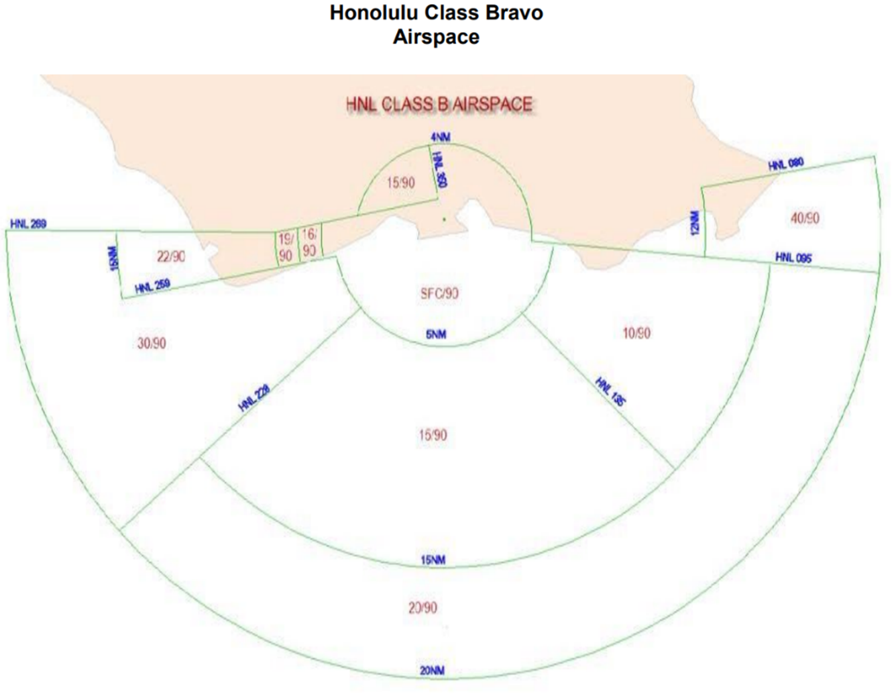

# Honolulu (HNL)

??? info "Revision Info"
    - Document Number: HNL 7110.1
    - Date: 02 Feb 2024
    - Revision Version: **G**
    - Editor: Dirk Thorben Kottenhahn, HCF FE

??? note "Abbreviations"
    - **ASDE-X**: Airport Surface Detection Equipment, X-Band Radar
    - **ASR**: Airport Surveillance Radar
    - **CD**: Clearance Delivery
    - **GC**: Ground Control
    - **LC1**: Local Control 1 (North Tower)
    - **LC2**: Local Control 2 (South Tower)

!!! abstract "Quick Reference"
    - IFR Departure Altitude: 5,000
    - VFR Altitude: AOB 3,000
    - Pattern Altitude: AOB 1,500    
    - Missed Approach EAST OPS: Visual 5,000, Heading 150; or Instrument as Published
    - Missed Approach WEST OPS: Visual 4,000, Heading 180; or Instrument as Published

## Positions

| Callsign           | Position          | Radio Name           | Position ID | Frequency                       |
| ------------------ | ---------------- | ------------------ | ------------- | :---------------------------: |
| **HNL_DEL** | Delivery | Honolulu Clearance | CD | 121.400 |
| HIK_RMP | Ramp | Hickam Ramp | HR | 133.600 |
| HNL_S_RMP | Ramp | Honolulu Ramp | SR | 121.800 |
| **HNL_GND** | Ground | Honolulu Ground | GC | 121.900 |
| **HNL_N_TWR** | North Tower | Honolulu Tower | LC1 | 118.100 |
| HNL_S_TWR | South Tower | Honolulu Tower | LC2 | 123.900 |
| **HNL_E_APP** | East Approach | HCF Approach | EA | 124.800 |
| HNL_W_APP | West Approach | HCF Approach | WA | 118.300 |
| HNL_ATIS | ATIS | Honolulu ATIS | - | 127.900 |

Bold designates Primary Position

## Runway Configurations
### General
- Aircraft will not land or depart on runways with a 10 knots or greater tailwind component, unless the pilot requests to do so and is operationally ok.
- All heavy and/or large four-engine turbo engine jet aircraft must depart on 8R, 26R, 22L or 26L, except aircraft bound for an Outer Island may depart runway 8L. LC may depart narrow body/small aircraft on 8L, 4L or 4R.
- Do not authorize turbojet/large four-engine propeller driven aircraft to depart runway 4R or 4L, except: during daylight hours only, turbojet aircraft with gross take-off weight less than 22,000 pounds may depart runway 4R. Instruct aircraft to execute a right turn to their assigned departure heading prior to runway 8L.
- The calm wind operation is East Ops.

### East Ops
- Departure and Arrival runways are 8L, 8R and 4R.
- Heavy Aircraft must depart runway 8R.

### West Ops
- Arrival Runways are 26L and 22L.
- Departure Runways are 26R and 22L.

### Event Ops
- Runways 4/8: All large aircraft and above (inclusive of turboprops) must be taxied to Runway 8R.
- Runways 22/26: All large aircraft and above (inclusive of turboprops) must be taxied to Runway 26R unless operational requirements require Runway 22L or Runway 26L (i.e., F22 to Runway 22L)

## Clearance Delivery
### Departure Instructions
- Initial altitude for all IFR Aircraft shall be 5,000 feet.
- VFR aircraft remaining in the pattern shall receive clearance INTO the Bravo airspace at altitude of 1,500 or below.
- VFR aircraft departing the Class Bravo shall receive clearance OUT of the Bravo airspace and maintain VFR at or below 3000.
    - VFR Helicopter see below.
- VFR aircraft not remaining with the pattern and requesting flight following will be given the appropriate departure frequency

### Departure Headings
| SID           | Ops       | Heading JET       | Heading PROP |
| ------------------ | :--------------: | :----------------: | :-------------: |
| MKK#, PALAY# | East Ops | 155 | 130 |
| KEOLA#, OPIHI# | East Ops | 155 | 155 |
| MKK#, PALAY#, KEAHI# | West Ops | 220 | 180 |
| KEOLA#, OPIHI# | West Ops | 220 | 220 |

- During East Ops:
    - Practice Approaches to RW 4R and 8L as well as departures to JRF and NGF will receive 155 Heading.
    - Departures to HHI will receive 155 Heading.
- During West Ops:
    - Departures to JRF, HHI and NGF will receive 220 Heading.

### Departure Frequency
- East Ops: 124.800
- West Ops: 118.300 (124.800 when combined)

### Helicopter Operations
- East Ops
    - Shoreline Departure: Maintain AOB 500 while in the Class B
    - Freeway Departure: Maintain AOB 1,000 while in the Class B
    - Redhill Departure – Maintain AOB 1,000 while in the Class B
- Helicopter Operations during West Ops
    - West Loch Departure – Maintain AOB 1,000 while in the Class B
    - SHORELINE DEPARTURES ARE NOT PERMITTED.
    - Kona Departure – Proceed direct to the VOR Building (VOR visual reference point) then fly southbound. Maintain AOB 1,000 while in the Class B

## Ground Control
### General
- GC has control of all taxiways with the exception of taxiways between runway 04L and 04R, 22R and 22L, and Taxiway C between 04R/22L and 8L/26R.
- GC shall ensure that aircraft are squawking Mode Charlie and their assigned beacon code prior to re-ceiving taxi clearance.
- GC shall respond to aircraft as first come first served. This does not include sequencing aircraft or any TMU restrictions.

### Standardized Taxi Routings
- East Ops:
    - Taxiway G northbound to Terminal 1, Taxiway L southbound
    - Taxiway V northbound to Hickam Ramp, Taxiway T southbound
- West Ops:
    - Taxiway L northbound to Terminal 1, Taxiway G southbound
    - Taxiway T northbound to Hickam Ramp, Taxiway V southbound

## Local Control
### General
- Multiple runway crossings with a single clearance are authorized for the following:
    - Runway 4R/22L and 4L/22R at TWY F
    - Runway 4R/22L and 4L/22R at TWY D
    - Runway 4R/22L and 4L/22R at TWY E
    - Runway 4R/22L and 4L/22R at TWY C
    - Runway 4L/22R and 8L/26R at TWY K
    - Runway 4L/22R and 4R/22L or 4L/22R and 8L/26R at TWY E
- LC has responsibility for all taxiways between runways 4L/22R, 4R/22L and taxiway C between runway 8L/26R and 4R/22L.
- LC has responsibility for active runway selection based on weather conditions.
- IFR circling approaches are not authorized north of the airport

### Airspace
LC has responsibility for all Class B airspace within 5 miles of the airport’s surface up to and in-cluding 3,000 MSL.
{ align=left }

### Land and Hold-Short Operations
| Landing Runway | Hold Short Point | Available Landing Distance |
|:--------------:|:----------------:|:--------------------------:|
| 4L             | 8L/26R           | 3700 FT                    |
| 4R             | 8L/26R           | 6250 FT                    |
| 8L             | 4L/22R           | 9300 FT                    |

### Line Up and Wait
- LUAW is authorized at HNL except when the ceiling is below 800ft or visibility below 2nm.
- Landing clearence need not be withheld if traffic is holding in position.

### Missed Approaches/Go-Arounds
- Advise aircraft on a visual missed approach in East Ops to fly heading 150, climb and maintain 5,000ft and expect vectors to final approach course by contacting TRACON.
- Advise aircraft on a visual missed approach in West Ops to fly heading 180, climb and maintain 4,000ft and expect vectors to final approach course by contacting TRACON.
- Advise aircraft on an instrument missed approach to fly the published missed approach and contact TRACON.

## Full SOP
For more details, refer to the [full SOP](https://www.vhcf.net/storage/files/_1720206777.pdf)