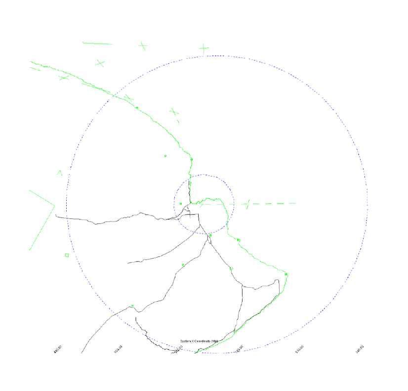

# 3. Local Control

## 3.1 - Responsibilities

1. LC is responsible for all aircraft operating in the class “D” airspace.
2. LC is responsible for selecting the active runways based on the weather conditions.
3. LC must communicate runway changes with the appropriate Center Controller as well as GC and must ensure that all controllers are ready for the switch.

## 3.2 - Airspace

1. LC Airspace is all the area within Class D airspace defined as a 5 mile radius from the center of the airport, up to and including 2,500’ AGL.

## 3.3 - Departure Procedures

1. LC shall provide proper spacing to all aircraft in the Hilo Class “D”
2. LC is required to obtain departure releases from Hilo Approach or HCF Center for all IFR aircraft
3. LC may use rolling calls if properly coordinated and approved by Approach or Center.
4. LC shall transfer communication to ITO_APP or HCF Center as soon as feasible after departure.
5. VFR departures remaining within the Class “D” shall remain on the Tower frequency.
6. IFR departures shall be assigned departure instructions based on the following IFR departure headings table:

| Runway | Heading |
|:---:|:---:|
| 03 & 08 | Runway Heading |
| 21 & 26 | Turn Right 360 |

7. Diverse Vector Area (DVA)
   1. RWY 3: 340° CW 170° out to 20 NM
   2. RWY 8: 330° CW 170° out to 20 NM
   3. RWY 21: 050° CW 140° out to 20 NM
   4. RWY 26: 350° CW 60° out to 20 NM

## 3.4 - Arrival Procedures

1. LC is responsible for proper separation of all aircraft under their control.
2. LC shall provide VFR aircraft with entry instructions into the pattern.
3. Land and Hold Short operations (LAHSO) are not authorized at ITO.

## 3.5 - Departure Releases

1. LC will request a Departure Release to Hilo/HCF Center for all IFR departures unless blanket releases are in effect.
2. Departure Releases/Rolling Calls will include the following content:
   1. Aircraft Callsign
   2. SID or Initial Waypoint
   3. Departure Runway
3. If Blanket Releases are in effect, a Rolling Call will be sent to Approach/Center for each IFR departure.

## 3.6 - Missed Approaches/Go-Arounds

1. Advise all IFR aircraft on Missed Approach/Go Arounds to fly the Published Missed Approach and contact TRACON.
2. If TRACON is not online, advise IFR to fly the Published Missed Approach and monitor Unicom. If aircraft does not have the published missed approach or is on a Visual Go Around, advise aircraft to fly a heading in accordance with 3.2.6.
3. Missed Approaches may be vectored below the MVA in accordance with JO 7110.65, 5-6-3. Approved Headings are as follows:
   1. RWY 3: N/A
   2. RWY 8: Heading 010 to 120
   3. RWY 26: Heading 010 to 120
   4. RWY 21: N/A

## 3.7 - Closed Traffic

1. VFR aircraft may operate in the pattern at or below 1,500 feet.
2. Runway 8 shall utilize left closed traffic, runway 26 shall utilize right closed traffic.
3. Runway 21 shall utilize right closed traffic, runway 3 shall utilize left closed traffic.

## 3.8 - Opposite Direction Operations

1. Scope. These procedures apply to same runway ODO at ITO between an:
   1. Arrival and a departure
   2. Arrival and an arrival
2. Definition. Opposite Direction Operations: IFR/VFR Operations conducted to the same or parallel runway where an aircraft is operating in a reciprocal direction of another aircraft arriving, departing, or conducting an approach.
3. Responsibilities.
   1. Local Control and TRACON Arrival radar share the responsibilities to coordinate ODO and issue traffic advisories.
   2. LC is responsible to apply the cutoff point(s) between arriving and departing aircraft.
   3. TRACON Arrival radar is responsible to apply the cutoff point(s) between successive ODO arrivals.
4. Procedures for Aircraft Receiving IFR Services.
   1. General
      1. These procedures are applicable only when TRACON radar is operational.
      2. ODO procedures are applicable when two aircraft will execute approaches to opposite ends of the same runway, or an aircraft will depart prior to an arrival on an opposite direction approach to the same runway.
      3. Traffic advisories must be issues to both aircraft
         1. Example- “OPPOSITE DIRECTION TRAFFIC (distance) MILE FINAL, (type aircraft).”; “OPPOSITE DIRECTION TRAFFIC DEPARTING RUNWAY (number), (type air-craft).”; “OPPOSITE DIRECTION TRAFFIC (position), (type aircraft).”
      4. Do not allow opposite direction same runway operations with opposing traffic inside the cutoff point unless an emergency situation exists.
      5. Use of visual separation is not authorized for aircraft receiving IFR services that are conducting ODO to the same runway.
   2. Coordination
      1. LC and TRACON Arrival radar are responsible for initiating coordination required to accomplish an opposite direction arrival or departure.
      2. Tower must verbally request opposite direction departures with TRACON.
      3. TRACON must verbally request opposite direction arrivals with Tower.
   3. Cutoff Procedures: For aircraft receiving IFR services and conducting opposite direction same runway operations:
      1. A departing aircraft, including an aircraft performing a touch-and-go or stop-and-go, must be airborne and established in a turn to avoid conflict prior to an aircraft reaching:
         1. A point ten (10) flying miles from the threshold of the runway of intended landing.
         2. If an aircraft is established in the traffic pattern, prior to that aircraft turning base leg.
      2. An aircraft performing a go-around, low approach, or missed approach must be issued and established in a turn to avoid conflict prior to an aircraft reaching:
         1. A point ten (10) flying miles from the threshold of the runway of intended landing.
         2. If an aircraft is established in the traffic pattern, prior to that aircraft turning base leg.
      3. An arriving aircraft must cross the runway threshold prior to an aircraft reaching:
         1. A point ten (10) flying miles from the threshold of the runway of intended landing, regardless of aircraft type
         2. If an aircraft is established in the traffic pattern, prior to that aircraft turning base leg.
      4. If the above conditions are not met, action must be taken to ensure control instructions are issued to protect the integrity of the cut off points.
5. Procedures for VFR/VFR and VFR/IFR Operations
   1. When conducting departure versus arrival opposite direction operations, LC must ensure that a departing aircraft is airborne and turned to avoid all conflicts with opposing IFR/VFR traffic and apply separation established as follows:
      1. Between two VFR aircraft, ten (10) flying miles from the airport on a non-conflicting course.
      2. Between a VFR and an IFR aircraft ten (19= flying miles from the airport on a non-conflicting course.
   2. If coordination is required, LC must state the phrase “OPPOSITE DIRECTION”.
   3. LC must issue traffic to both aircraft and indicate the direction that the departure will turn (arrival/departure) or the location of the opposing aircraft on final (arrival/arrival).

