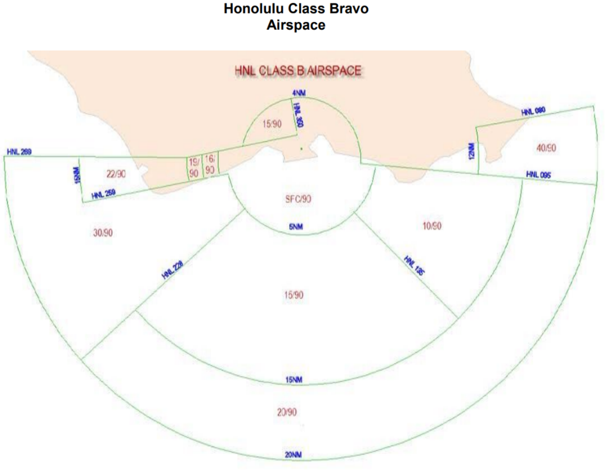

# Honolulu (HNL)

??? info "Revision Info"
    - Document Number: HNL 7110.1
    - Date: 02 Feb 2024
    - Revision Version: **G**
    - Editor: Dirk Thorben Kottenhahn, HCF FE

??? note "Abbreviations"
    - **ASDE-X**: Airport Surface Detection Equipment, X-Band Radar
    - **ASR**: Airport Surveillance Radar
    - **CD**: Clearance Delivery
    - **GC**: Ground Control
    - **LC1**: Local Control 1 (North Tower)
    - **LC2**: Local Control 2 (South Tower)

!!! abstract "Quick Reference"
    - IFR Departure Altitude: 5,000
    - VFR Altitude: AOB 3,000
    - Pattern Altitude: AOB 1,500
    - Missed Approach EAST OPS: Visual 5,000, Heading 150; or Instrument as Published
    - Missed Approach WEST OPS: Visual 4,000, Heading 180; or Instrument as Published

## 1 - Positions

| Callsign           | Position          | Radio Name           | Position ID | Frequency                       |
| ------------------ | ---------------- | ------------------ | ------------- | :---------------------------: |
| **HNL_DEL** | Delivery | Honolulu Clearance | CD | 121.400 |
| HIK_RMP | Ramp | Hickam Ramp | HR | 133.600 |
| HNL_S_RMP | Ramp | Honolulu Ramp | SR | 121.800 |
| **HNL_GND** | Ground | Honolulu Ground | GC | 121.900 |
| **HNL_N_TWR** | North Tower | Honolulu Tower | LC1 | 118.100 |
| HNL_S_TWR | South Tower | Honolulu Tower | LC2 | 123.900 |
| **HNL_E_APP** | East Approach | HCF Approach | EA | 124.800 |
| HNL_W_APP | West Approach | HCF Approach | WA | 118.300 |
| HNL_ATIS | ATIS | Honolulu ATIS | - | 127.900 |

Bold designates Primary Position

## 2 - Runway Configurations

### 2.1 - General

1. Aircraft will not land or depart on runways with a 10 knots or greater tailwind component, unless the pilot requests to do so and is operationally ok.
2. All heavy and/or large four-engine turbo engine jet aircraft must depart on 8R, 26R, 22L or 26L, except aircraft bound for an Outer Island may depart runway 8L. LC may depart narrow body/small aircraft on 8L, 4L or 4R.
3. Do not authorize turbojet/large four-engine propeller driven aircraft to depart runway 4R or 4L, except: during daylight hours only, turbojet aircraft with gross take-off weight less than 22,000 pounds may depart runway 4R. Instruct aircraft to execute a right turn to their assigned departure heading prior to runway 8L.
4. The calm wind operation is East Ops.

### 2.2 - Change in Runway Configuration

1. The CIC must determine the need for making any runway change. A routine runway change oc-curs when traffic and/or weather conditions are such that the change can be made with little or no degradation in service. In this instance, departures are allowed to depart from the runway originally assigned. Use the following procedures to complete a routine runway change
   1. Provide Approach with the last departure’s identification, its estimated time of departure, and the departure runway.
   2. Once the last aircraft departs, ensure no other aircraft departs HNL without a release from Approach.
   3. Ensure that departures off the new runway have received the appropriate departure con-trol frequency and departure heading (if given by Clearance), as needed.
   4. Approach shall inform the CIC when the sector reconfiguration has been completed.
   5. Ensure the ATIS has been updated and reflects the proper status.

### 2.3 - East Ops

1. Departure and Arrival runways are 8L, 8R and 4R.
2. Heavy Aircraft must depart runway 8R.
3. Assign and taxi all large Twin Turbo prop aircraft from the North Ramp to RWY 8R for departure
4. Assign and taxi all twin prop and smaller aircraft from the south ramp to RWY 4R/4L TWY F for departure.

### 2.4 - West Ops

1. Arrival Runways are 26L and 22L.
2. Departure Runways are 26R and 22L.
3. This configuration should be chosen if the weather is in such a condition that East Ops is not viable anymore, see 2.1.1 for reference.

### 2.5 - Event Ops

1. Runways 4/8: All large aircraft and above (inclusive of turboprops) must be taxied to Runway 8R.
2. Runways 22/26: All large aircraft and above (inclusive of turboprops) must be taxied to Runway 26R unless operational requirements require Runway 22L or Runway 26L (i.e., F22 to Runway 22L)

## 3 - Clearance Delivery

### 3.1 - Departure Instructions

1. Initial altitude for all IFR Aircraft shall be 5,000 feet.
2. VFR aircraft remaining in the pattern shall receive clearance INTO the Bravo airspace at altitude of 1,500 or below.
3. VFR aircraft departing the Class Bravo shall receive clearance OUT of the Bravo airspace and maintain VFR at or below 3000.
   1. VFR Helicopter see below.
4. VFR aircraft not remaining with the pattern and requesting flight following will be given the appropriate departure frequency

### 3.2 - Departure Headings

| SID           | Ops       | Heading JET       | Heading PROP |
| ------------------ | :--------------: | :----------------: | :-------------: |
| MKK#, PALAY# | East Ops | 155 | 130 |
| KEOLA#, OPIHI# | East Ops | 155 | 155 |
| MKK#, PALAY#, KEAHI# | West Ops | 220 | 180 |
| KEOLA#, OPIHI# | West Ops | 220 | 220 |

1. During East Ops:
   1. Practice Approaches to RW 4R and 8L as well as departures to JRF and NGF will receive 155 Heading.
   2. Departures to HHI will receive 155 Heading.
2. During West Ops:
   1. Departures to JRF, HHI and NGF will receive 220 Heading.

### 3.3 - CPDLC and PDCs

When advantageous, controllers should make use of Pre-Departure Clearance (PDC). The Departure Heading can be included in the PDC in accordance with the SOP.

### 3.4 - Departure Frequency

1. East Ops: 124.800
2. West Ops: 118.300 (124.800 when combined)

### 3.5 - Helicopter Operations

1. East Ops
   1. Shoreline Departure: Maintain AOB 500 while in the Class B
   2. Freeway Departure: Maintain AOB 1,000 while in the Class B
   3. Redhill Departure – Maintain AOB 1,000 while in the Class B
2. Helicopter Operations during West Ops
   1. West Loch Departure – Maintain AOB 1,000 while in the Class B
   2. SHORELINE DEPARTURES ARE NOT PERMITTED.
   3. Kona Departure – Proceed direct to the VOR Building (VOR visual reference point) then fly southbound. Maintain AOB 1,000 while in the Class B

## 4 - Ground Control

### 4.1 - General

1. GC is responsible for the movement of all aircraft on the movement area to and from the runways.
2. GC has control of all taxiways with the exception of taxiways between runway 04L and 04R, 22R and 22L, and Taxiway C between 04R/22L and 8L/26R.
3. GC shall ensure pilots have the current ATIS.
4. GC shall ensure that aircraft are squawking Mode Charlie and their assigned beacon code prior to re-ceiving taxi clearance.
5. GC shall respond to aircraft as first come first served. This does not include sequencing aircraft or any TMU restrictions.
6. Taxiway P closed to aircraft over 12,500 lbs.
7. Aircraft on taxiway R must be held short of the appropriate hold line for conflicting traffic on approach to either runway 4L or 4R. During runway 22/26 configuration, only ADG V and above aircraft must be held short of the appropriate hold line for traffic departing runway 22L/22R
8. Do not allow aircraft larger than a B737/B717 to make a 180 degree turn on taxiway A west of taxiway A1. This restriction also applies to taxiways V and T north of RWY 8L.

### 4.2 - Standardized Taxi Routings

1. East Ops:
   1. Taxiway G northbound to Terminal 1, Taxiway L southbound
   2. Taxiway V northbound to Hickam Ramp, Taxiway T southbound
2. West Ops:
   1. Taxiway L northbound to Terminal 1, Taxiway G southbound
   2. Taxiway T northbound to Hickam Ramp, Taxiway V southbound

### 4.3 - Pushback Procedures

1. When an aircraft calls ground control requesting pushback instructions from a non-movement area, and the aircraft will remain in a non-movement area, include the phraseology “at pilot’s discretion”
   1. EXAMPLE – DAL21 pushback at pilot’s discretion. Remain clear of TWY Z.
2. When an aircraft calls ground control requesting pushback instructions and the aircraft will enter a movement are, i.e., taxiway, issue authorization on the taxiway/movement area.
   1. EXAMPLE – DAL21 pushback on TWY Z. Tail/Face east
   2. EXAMPLE – DAL21 pushback on TWY Z approved. Tail/Face east
3. If Ramp Control is online, they will handle the startups and pushbacks inside the non-movement areas. Gates that need a pushback clearance into a movement area are still GC responsibility.

### 4.4 - Operations when Local Control is split

1. Instruct all aircraft taxiing to RWY 8R from the south ramp to hold short of RWY 4R approach and monitor tower on 118.1
2. When aircraft from the North ramp require RWY 26L (22/26 configuration) for departure due to operational necessity GC taxi the aircraft to hold short of RWY 26R at TWY D and advise aircraft to monitor tower on 118.1.
3. Deliver all full flight progress strips as designated (RWY 4/8)
   1. RWY 8R departure, pass flight progress strip to LC2
   2. RWY 8R departure from the south ramp, pass flight progress strip to LC2,
   3. Pass all military flight plans to LC 1 that will be outbound on TWY T or M.
   4. Pass all flight progress strips for aircraft taxing from the Hickam AMC (outbound at A1 -A4) ramp to LC2.
   5. Pass all helicopters (and float planes) flight progress strips departing on the Shoreline departure to LC2. All other helicopters and VFR departure route fixed wing aircraft will be passed to LC1.
   6. NOTE: Shoreline departures for fixed wing aircraft, except for float planes, are not authorized when LC1 and LC2 are de-combined.
4. Deliver all flight progress strips as designated (RWY 22/26)
   1. Pass all RWY 26R, 22L, 22R departure flight progress strips to LC1.
   2. Pass all RWY 26L departure flight progress strips to LC2.
   3. Pass all helicopter, VFR departure route fixed wing aircraft, and float plane departures strips to LC 1.

## 5 - Local Control

### 5.1 - General

1. Splitting into North and South Tower is only allowed when the following requirements are fulfilled:
   1. The following positions must be staffed:
      1. North Tower
      2. Ground
      3. Clearance Delivery
   2. Runway 8R/26L must be open.
   3. All landing and departure clearances must be on the frequency of the controller who has responsibility for the landing or departing aircraft.
   4. North Tower must quick look South Tower and vise-versa.
2. LC may delegate that portion of a closed runway that does not intersect with an active runway to GC for the purpose to crossing.
3. Hold lines between runways 4L/22R and 4R/22L are 20 feet apart. Do not clear an aircraft to depart behind an aircraft holding between the runways. Do not clear an aircraft to depart behind an aircraft holding between the runways.
4. Multiple runway crossings with a single clearance are authorized for the following:
   1. Runway 4R/22L and 4L/22R at TWY F
   2. Runway 4R/22L and 4L/22R at TWY D
   3. Runway 4R/22L and 4L/22R at TWY E
   4. Runway 4R/22L and 4L/22R at TWY C
   5. Runway 4L/22R and 8L/26R at TWY K
   6. Runway 4L/22R and 4R/22L or 4L/22R and 8L/26R at TWY E
5. LC has responsibility for all taxiways between runways 4L/22R, 4R/22L and taxiway C between runway 8L/26R and 4R/22L.
6. LC has responsibility for active runway selection based on weather conditions and with section 2 in mind.
7. IFR circling approaches are not authorized north of the airport

### 5.2 - Airspace

LC has responsibility for all Class B airspace within 5 miles of the airport’s surface up to and in-cluding 3,000 MSL.
{ align=left }

1. Runway 4/8 –Tower airspace is defined as Area B and Area C. The vertical limit in Area B is 2,500’. The vertical limit in Area C is 5,000’.
2. NOTE: When LC2 is de-combined, LC2 must be delegated that airspace south and east of run-ways 8L, 8R, and 4R within Area C south of the shoreline.
3. Runway 22/26 – Tower airspace is defined as Area B and Area C. The vertical limit in Area B is 3,000’, except in the departure corridor (defined as south of the extended centerline of runway 26R in Area B), the vertical limit is 5,000’. The vertical limit in Area C is 3,000’.
4. NOTE: When LC2 is de-combined, there is no change to delegated airspace in a runway 22/26 configuration.

### 5.3 - Land and Hold-Short Operations

| Landing Runway | Hold Short Point | Available Landing Distance |
|:--------------:|:----------------:|:--------------------------:|
| 4L             | 8L/26R           | 3700 FT                    |
| 4R             | 8L/26R           | 6250 FT                    |
| 8L             | 4L/22R           | 9300 FT                    |

### 5.4 - Line Up and Wait

1. LUAW procedures are authorized at HNL. Such operations are generally viewed as necessary to maintain airport efficiency. Use LUAW when it is expected the aircraft will depart after conflicting traffic is clear of the runway/intersection. Utilize good operating practices and memory aids as needed when using LUAW procedures.
2. LUAW is authorized at HNL except when the ceiling is below 800ft or visibility below 2nm.
3. Landing clearence need not be withheld if traffic is holding in position.

### 5.5 - Departure Procedures

1. LC shall provide separation for aircraft in the LC airspace.
2. LC shall provide initial radar separation between all successive departures.
3. LC will request departure releases from TRACON for all IFR Departures.
4. LC may opt to use rolling calls if TRACON provides blanket releases.
5. LC will ensure that all IFR departures communication will be transferred to TRACON within ½ mile of the end of the runway.
6. VFR departures will remain with LC until leaving LC airspace. Upon leaving LC airspace, the aircraft will be handed off to TRACON unless they are departing the Class Bravo to the North and did not request flight following.
7. VFR departures not requesting flight following who are departing the airspace to the north, shall be instructed to remain clear of the Class Bravo.

### 5.6 - Arrival Procedures

1. LC shall be responsible for separation of all arrival aircraft that have been handed off by TRACON from all departing aircraft still under LC jurisdiction.
2. LC shall be responsible for separation of all operating IFR aircraft under the LC jurisdiction from all operating VFR aircraft.
3. LC shall provide VFR arrivals with clearances into the Class Bravo, entry instructions into the pattern and the altimeter.
4. Wide-body and four engine turbojets landing on 4R are not allowed to turn left onto taxiway K without LC approval.

### 5.7 - Departure Releases

1. LC will request a departure release for all IFR departures unless a blanket release is authorized by the TRACON controller.
2. Departure releases will include:
   1. Aircraft Callsign
   2. SID or Initial Waypoint
   3. Departure Runway

### 5.8 - Missed Approaches/Go-Arounds

- Advise aircraft on a **visual** missed approach in East Ops to fly heading 150, climb and maintain 5,000ft and expect vectors to final approach course by contacting TRACON.
- Advise aircraft on a **visual** missed approach in West Ops to fly heading 180, climb and maintain 4,000ft and expect vectors to final approach course by contacting TRACON.
- Advise aircraft on an **instrument** missed approach to fly the published missed approach and contact TRACON.

### 5.9 - Runway Length Remaining

| Runway 8L | 12,300 | Runway 26R || Runway 4R | 9,000 | Runway 22L |
|:---:|:---:|:---:|---|:---:|:---:|:---:|
| 7,400 | L | 4,850 || 6,900 | F | 2,050 |
| 6,850 | G | 5,400 || 5,500 | D | 3,500 |
| 5,150 | D | 7,100 || 4,000 | E | 4,950 |
| 4,100 | H | 8,150 || 3,250 | K | 5,700 |
| 3,650 | E | 8,650 || 2,750 | P | 6,200 |
| 2,100 | K | 10,100 || 2,350 | 8L | 6,600 |
| 1,350 | 4R | 10,900 ||  |  |  |
|  | C | 11,700 ||  |  |  |

| Runway 8R | 12,000 | Runway 26L || Runway 4L | 6,952 | Runway 22R |
|:---:|:---:|:---:|---|:---:|:---:|:---:|
| 11,500 | RC | 450 || 5,350 | D | 1,550 |
| 8,050 | RM | 3,900 || 3,900 | E | 3,000 |
| 3,900 | RG | 8,050 || 2,700 | K | 4,200 |
| 450 | RH | 11,500 ||  |  |  |

### 5.10 - LC1 Responsibilities when split

1. Will have responsibility for operations on RWY 8L, 4L, and 4R
2. Handles all runway crossings
3. Manages ground traffic on taxiways at the approach end of RWY8L
4. Manages ground traffic on taxiways between RWY 8L and 4R not including those Taxiways dele-gated to LC2
5. Shall have automatic release authority for aircraft departing on the Redhill, Freeway, and Punch-bowl VFR departure routes. LC1 will issue a traffic advisory to LC2 for Punchbowl departures.
6. LC1 must request from LC2 for all IFR aircraft departing RWY 8L, 4R/4L.
   1. PHRASEOLOGY: LC2, LC1 APREQ IFR release on (ACID), (Type aircraft), (Initial departure heading), and (RWY departing).
   2. EXAMPLE: LC1: "LC2, LC1, APREQ IFR release on CPT8700, C208 heading 120, departing RWY 4L. "
   3. RESPONSE FROM LC2: "Released " or "Follow HAL218, B717 departing RWY 8R heading 140, released."
7. When a HOLD FOR RELEASE is given to LC1 by LC2 for a departure, LC1 must place the HOLD FOR RELEASE memory aide placard on the departure strip for which the release was requested.
8. Must provide a point-out to LC2 for aircraft flying an extended downwind to RWY 4R/L.
   1. LC1 shall have approval/disapproval authority for fighter aircraft requesting the overhead approach to RWY 4R. Overhead approaches to RWY 4R must be APREQ 's by Approach Control with LC1. LC1 shall then advise LC2 of the arriving fighters.
9. LC1 is responsible for that area on taxiway RA between the runway 4R Approach hold lines. De-parting aircraft from taxiway C on taxiway RA will be held short of the Runway 4R final approach and switched to LC I frequency. LC1 will taxi aircraft in the Runway 4R final approach course on RA to avoid overflight by aircraft under their control. LC1must issue traffic to LC2 on any Punch-bowl VFR departure.
   1. PHRASEOLOGY: "Traffic, N9118Z, PA28, departing on the Punchbowl."
   2. LC2: "Traffic observed."

## 6 - Ramp Control

### 6.1 - General

1. Ramp Control will be responsible for all movement in the non-movement areas. If Ramp Control is online, Clearance Delivery will transfer pilots to Ramp Control if a startup and pushback happens fully inside the non-movement area.
2. Pushbacks onto a taxiway are done by GC and not Ramp Control.
3. Ramp Control is an event only position or if Staff approves it due to traffic volume. Additionally, the following requirement needs to be fulfilled:
   1. Ramp Control is only allowed to be active when a Ground Controller as well as a Local Controller are at least online.
4. When there is no Delivery Clearance online, then Ramp Control takes over these duties for their specific area.

### 6.2 - Hickam Ramp

1. Hickam Ramp has jurisdiction for the whole Hickam Ramp which includes taxiways T and V up to taxiway A. Additional jurisdiction is carried for the Hawaii Air NG ramp as well as the Hazardous Cargo Pad.
2. Hickam Ramp is not responsible for the civilian ramps and these duties fall then to Ground Control if Civilian Ramp Control is offline.

### 6.3 - Honolulu Ramp

1. South Ramp is the primary Ramp Control for all civilian ramp areas which includes the Movement of Terminal 1 as well as the Taxiways G and L until meeting Taxiway Z as well as the Alley Taxi-ways North of Taxiway Z into the ramp.
