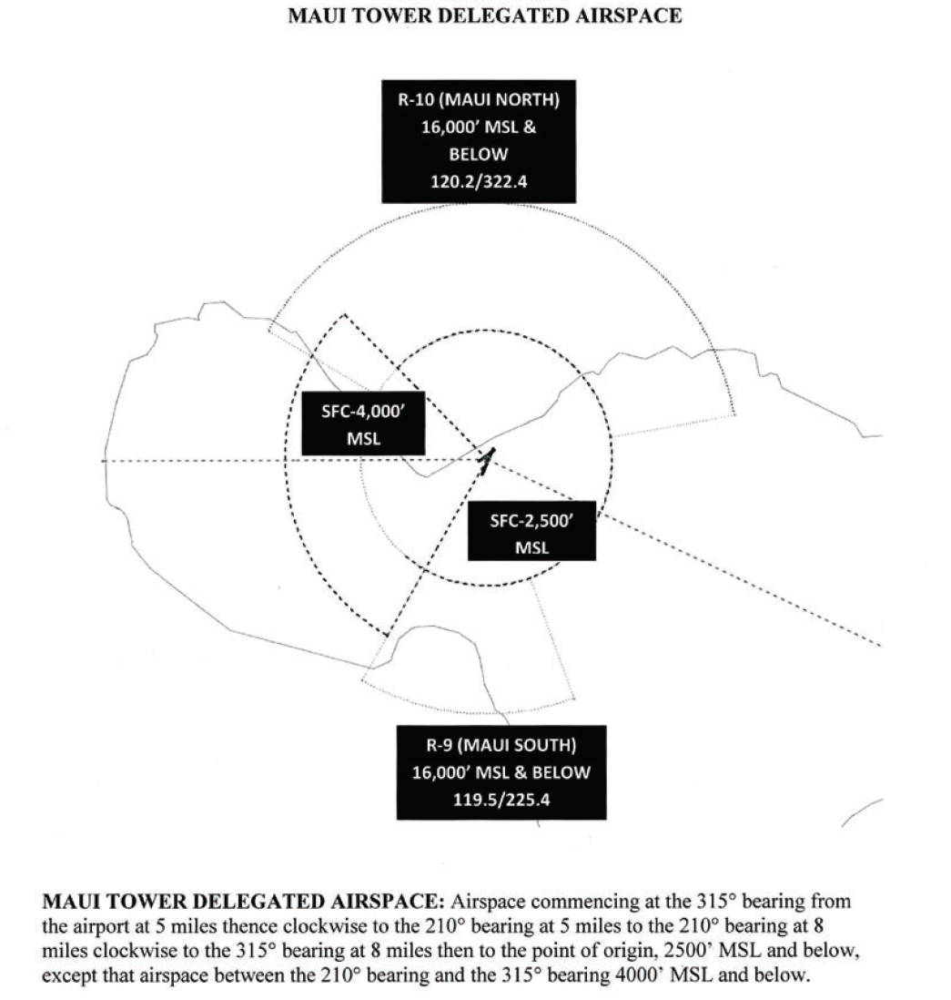
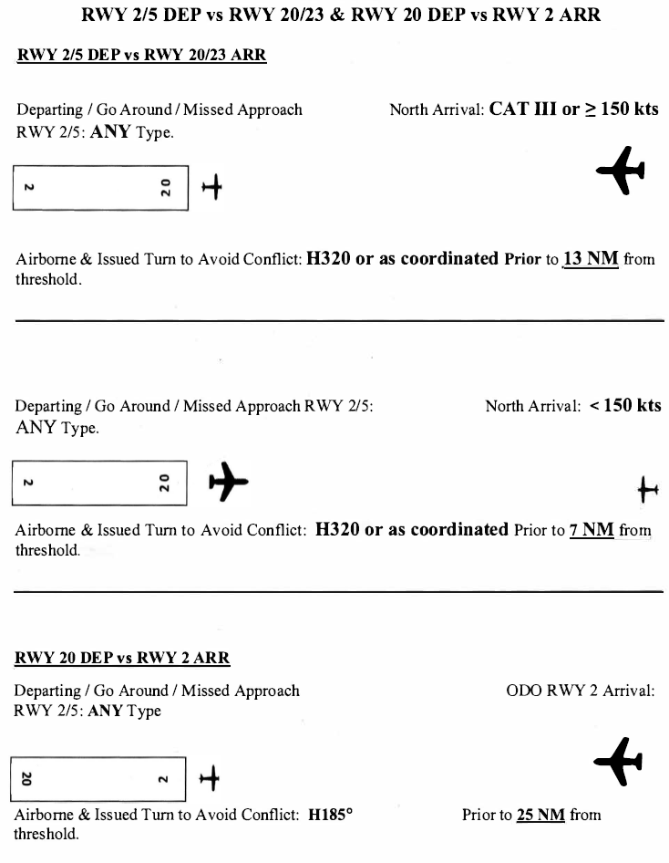

# 4. Local Control

## 4.1 - Responsibilities

1. LC is responsible for aircraft operating on all runways and aircraft operating within LC designated control defined below.
2. LC has responsibility for taxiway A between RWY 2 / 20 and RWY 5 / 23.
3. LC has responsibility for active runway selection based on weather conditions.
4. Do not land or depart on runways with a tailwind component of more than 10 knots.
5. LC must coordinate runway configuration changes with TRACON. LC must wait for TRACON notification of readiness before executing the new runway configuration.
6. The tower’s radar may be used to ensure separation between successive departures, between arrivals and departures, between departures/arrivals and over flights, between over flights and over flights, and between arrivals and arrivals.
7. The tower does not have a dedicated radar position but operates as a limited radar approach control facility. The tower is authorized to vector aircraft to ensure or to effect proper spacing between aircraft within the airspace. The effective functional use of the tower’s radar display is to:
    1. Identify targets
    2. Separate IFR and VFR aircraft.
    3. Use as an aid for sequencing and obtaining/providing traffic information.
8. Special VFR operations are prohibited.
9. LC shall issue special VFR (SVFR) clearances and request release on each SVFR departure from HCF Approach.
10. Approved separation for SVFR helicopters and fixed wing aircraft are the same. The separation used is that prescribed for IFR aircraft, including visual separation.

## 4.2 - Airspace

1. Airspace commending at the 315 bearing from the airport at 5 miles thence clockwise to the 210 bearing at 5 miles to the 210 bearing at 8 miles clockwise to the 315 bearing at 8 miles then to the point of origin, 2500 feet and below, except that airspace between the 210 bearing and the 315 bearing 4000 feet and below.
2. LC provides Class C services within the boundary of tower’s delegated airspace

## 4.3 - Departure Procedures

The following Departure SIDs are available at PHMK:

| SID | Initial Altitude |
|---|:---:|
| BEACH#, HIAKA# (RNAV), NPLII# (RNAV), ONOHI#, PUHII# (RNAV), STACY#, SWEEP# | 6,000 |
| MAUI# | 7,000 |

1. LC will provide separation for all aircraft in the LC airspace and provide initial separation between all successive departures.
2. LC will request departure releases from TRACON for all IFR departures.
3. LC may opt to use rolling calls if TRACON provides blanket releases.
4. VFR departures will remain with LC until leaving LC airspace. At which time, VFR departures requesting flight following will be verbally handed off to TRACON.
5. VFR departures not requesting flight following will be informed to remain clear of the Kahului Class Charlie and monitor Unicom (122.800).
6. **Line up and Wait (LUAW) is NOT authorized at Kahului.**
7. Diverse Vector Area (DVA)
    1. RWY 2: 316° CW 052° out to 15 NM
    2. RWY 5: 312° CW 040° out to 15 NM
    3. RWY 20: 173° CW 203° out to 15 NM
    4. RWY 23: N/A

## 4.4 - Arrival Procedures

1. LC shall be responsible for separation of all arrival aircraft that have been handed off by TRACON from all departing aircraft still under LC jurisdiction.
2. LC shall be responsible for separation of all operating IFR aircraft under LC jurisdiction from all operating VFR aircraft within the Kahului Class Charlie.
3. Communication transfer must be completed prior to five nautical miles from the runway.
4. LC shall provide VFR arrivals with entry instructions into the pattern and the field altimeter.
5. **Land and Hold Short (LAHSO) is NOT authorized at Kahului.**
6. Lockheed Galaxy, C5A, is not authorized to conduct a touch-and-go or an unrestricted low approach. They may land, depart or conduct restricted low approaches at or above 600 feet MSL.

## 4.5 - Departure Releases

1. LC will request a Departure Release to TRACON for all IFR departures unless blanket releases are in effect.
2. Departure Releases AND rolling calls will include the following content:
    1. Aircraft Callsign
    2. SID or Initial Waypoint
    3. Departure Runway
3. If Blanket Releases are in effect, a Rolling Call will be sent to TRACON for each IFR departure.

## 4.6 - Missed Approaches/Go-Arounds

1. Advise aircraft on an **instrument** approach to fly the published missed approach and to contact TRACON.
2. Advise aircraft on a **visual** missed approach in North ops to fly heading 020, climb and maintain 4,000ft and expect vectors to final approach course by contacting TRACON.
3. Advise aircraft on a **visual** missed approach in South ops to fly heading 185, climb and maintain 6,000ft and expect vectors to final approach course by contacting TRACON.

## 4.7 - Closed Traffic

1. VFR aircraft may operate in the pattern at Kahului at or below 1,500 feet.
2. Runway 2 - Right Closed Traffic
3. Runway 5 - Right Closed Traffic
4. Runway 20 - Left Closed Traffic
5. Runway 23 - Right Closed Traffic

## 4.8 - Intersection Departures

1. The local controller may initiate an intersection departure or authorize one if a pilot requests.

| RWY 2 | RWY 20 | RWY 5 | RWY 25 |
|:---|:---|:---|:---|
| From D - 6200' From E - 4850' From B – 4850' From F – 3450' | From 5/23 – 6050' From K – 5450' From G – 5250' From F – 3500' | From B – 3900' From A – 1750' | From 20 – 4100' From A – 3200' |

## 4.9 - Opposite Direction Operations

1. Scope. These procedures apply to same runway ODO at OGG between an:
    1. Arrival and a departure
    2. Arrival and an arrival
2. Definition. Opposite Direction Operations: IFR/VFR Operations conducted to the same or parallel runway where an aircraft is operating in a reciprocal direction of another aircraft arriving, departing, or conducting an approach. For the purposes here, IFR operations to runways 2/20 and 5/23 will be recognized as the “same runway”.
    1. Example: Departure off Runway 5 and requested ODO arrival to Runway 20, Departure off Runway 2 and ODO arrival to Runway 23).
3. Responsibilities.
    1. Local Control and Approach share the responsibilities to coordinate ODO and issue traffic advisories.
    2. LC is responsible to apply the cutoff point(s) between arriving and departing aircraft.
    3. Approach is responsible to apply the cutoff point(s) between successive ODO arrivals.
4. Procedures for Aircraft Receiving IFR Services.
    1. General
        1. These procedures are applicable only when TRACON radar is operational.
        2. ODO procedures are applicable when two aircraft will execute approaches to opposite ends of the same runway, or an aircraft will depart prior to an arrival on an opposite direction approach to the same runway.
        3. Traffic advisories must be issues to both aircraft
            1. Example - “OPPOSITE DIRECTION TRAFFIC (distance) MILE FINAL, (type aircraft).”; “OPPOSITE DIRECTION TRAFFIC DEPARTING RUNWAY (number), (type aircraft).”; “OPPOSITE DIRECTION TRAFFIC (position), (type aircraft).”
        4. Do not allow opposite direction same runway operations with opposing traffic inside the cutoff point unless an emergency situation exists.
        5. Use of visual separation is not authorized for aircraft receiving IFR services that are conducting ODO to the same runway.
    2. Coordination
        1. LC and Approach are responsible for initiating coordination required to accomplish an opposite direction arrival or departure.
        2. Tower must verbally request opposite direction departures with TRACON.
        3. Approach must verbally request opposite direction arrivals with Tower.
    3. Cutoff Procedures: For aircraft receiving IFR services and conducting opposite direction same runway operations:
        1. Arrival / Departure:
            1. A departing aircraft, including an aircraft performing a touch-and-go or stop-and-go, must be airborne and established in a turn to avoid conflict prior to an aircraft reaching the cutoff points outlined below.
            2. Cutoff points and restrictions also apply to aircraft performing a go-around, low approach or missed approach.
                1. Runway 2/5 Active:
                    1. RWY 20 departure must be airborne and issued a 185° heading prior to the arriving aircraft reaching a point **25** flying miles from the threshold of intended landing. Maui Tower will call for release.
                    2. RWY 23 IFR departures – not authorized.
                    3. RWY 2/5 departures must be airborne and issued a turn to a heading of 320° to avoid conflict (unless otherwise coordinated) prior to the aircraft arriving to RWY 20/23 reaches:
                        1. A point **13** flying miles from the threshold of the runway of intended landing, when the arriving aircraft is a CAT III or operating at speeds greater than or equal to 150 knots; or
                        2. A point **7** flying miles from the threshold of the runway of intended landing for aircraft less than 150 knots; or
                        3. If an aircraft is established in the traffic pattern, prior to that aircraft turning base leg.
                    4. If the above conditions are not met, action must be taken to ensure control instructions are issued to protect the integrity of the cutoff points.
                2. Runway 20/23 Active:
                    1. RWY 20/23 Departure vs. ODO RWY 2 Arrival. Departure must be airborne and issued a 185° heading prior to the ODO arriving aircraft reaching a point **25** flying miles from the threshold of intended landing. Maui Tower will call for release.
                    2. RWY 2/5 ODO departures must be airborne and issued a turn to a heading of 320° to avoid conflict prior to the aircraft arriving from the north reaching:
                        1. A point **13** flying miles from the threshold of the runway of intended landing, when the arriving aircraft is a CAT III or operating at speeds greater than or equal to 150 knots; or
                        2. A point **7** flying miles from the threshold of the runway of intended landing for aircraft less than 150 knots; or
                        3. If an aircraft is established in the traffic pattern, prior to that aircraft turning base leg.
                    3. If the above conditions are not met, action must be taken to ensure control instructions are issued to protect the integrity of the cutoff points.
        2. Arrival / Arrival
            1. An ODO arrival to RWY 2/5 must cross the runway threshold prior to an arriving aircraft to RWY 20/23 reaching a point **15** flying miles from the threshold of the runway of intended landing.
            2. If the ODO arrival to RWY 2/5 does a missed approach, LC must issue the aircraft a heading 320°, climb to 4,000 feet MSL or as coordinated by HCF Approach, and immediately switch communication to 120.200.
            3. An ODO arrival to RWY 20/23 must cross the runway threshold prior to an arriving aircraft to RWY 2/5 reaching a point **25** flying miles from the threshold of the runway of intended landing.
            4. If the ODO arrival to RWY 20/23 does a missed approach, LC must issue the aircraft a 185° heading, climb to 4,000 feet MSL or as coordinated by HCF Approach, and immediately switch communication to 119.500.
            5. ODO procedures inside the applicable cutoff points are not authorized unless an emergency situation exists. Once a departing IFR aircraft is airborne, diverging course separation may be applied (visual separation is not authorized); the required longitudinal or lateral separation must exist prior to the utilization of diverging course separation.
            6. If the above conditions are not met, action must be taken to ensure control instructions are issued to protect the integrity of the cutoff points.

