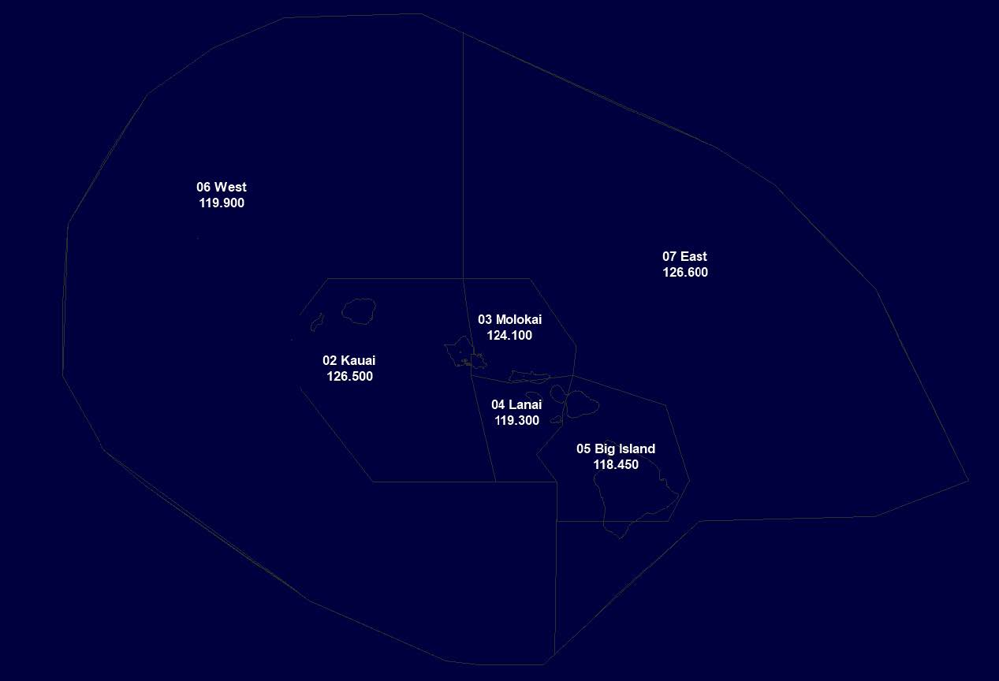

# 2. Sectors

## 2.1 - Sector Diagram

**Please not that HNL_02_CTR is the primary sector.**

## 2.2 - Purpose

Enroute sectors are defined by lateral and vertical boundaries of airspace. Controllers assuming control of any Enroute position(s) are responsible for all airspace within that position which is not controlled by another controller. Enroute controllers also assume control of any sector not already staffed by another Enroute controller within the confines of the HCF airspace.

## 2.3 - Combined Sectors

An Enroute controller assuming responsibility for HCF Enroute airspace shall use the designated “com-bined” primary position (i.e. HNL_02_CTR), unless that position is already staffed by another member. If a HCF Enroute controller wishes to sign on to an Enroute position that is otherwise already staffed by another HCF Enroute controller, then that controller can sign onto another Enroute position (i.e. HNL_03_CTR).

## 2.4 - Briefing and Sectorization

A controller preparing to assume control of a portion of airspace already being controlled by another Enroute controller **shall request control of that airspace and receive a position brief** from the appropriate controller(s) prior to assuming control of that airspace.

For example, if assuming control of the Molokai (03) sector from Kauai (02) a controller shall request the proper lateral airspace within the defined lateral boundaries from the Kauai sector. Once pre-coordination has been achieved between the relevant controllers, the Kauai sector is responsible for issuing au-tomated and/or verbal handoffs.

## 2.5 - Relief

HCF Enroute controllers that are discontinuing service shall announce their closure via the ATC channel utilizing the “forward slash (/)” prefix. If another controller is assuming control of airspace previously controlled, all aircraft shall be handed off to the appropriate Enroute controller.

Relieving controllers shall, to the extend possible, monitor the controller being relieved for no less than five minutes before relieving the other controller. This shall be done in order to gain a complete understanding of all traffic within the sector. Deviations from the standard procedures shall be agreed upon prior to the completion of the relief process between the relieving controller and the current controller.

## 2.6 - Handoffs

Handoffs shall, to the extend possible, be complete no less than five (5) nautical miles from the relevant sector boundary. If a handoff has not been completed no less than five miles from the relevant sector boundary, that aircraft shall be turned away from the adjacent airspace and placed in a hold or re-routed as appropriate.

Handoffs shall, to the extend possible, be accomplished.
