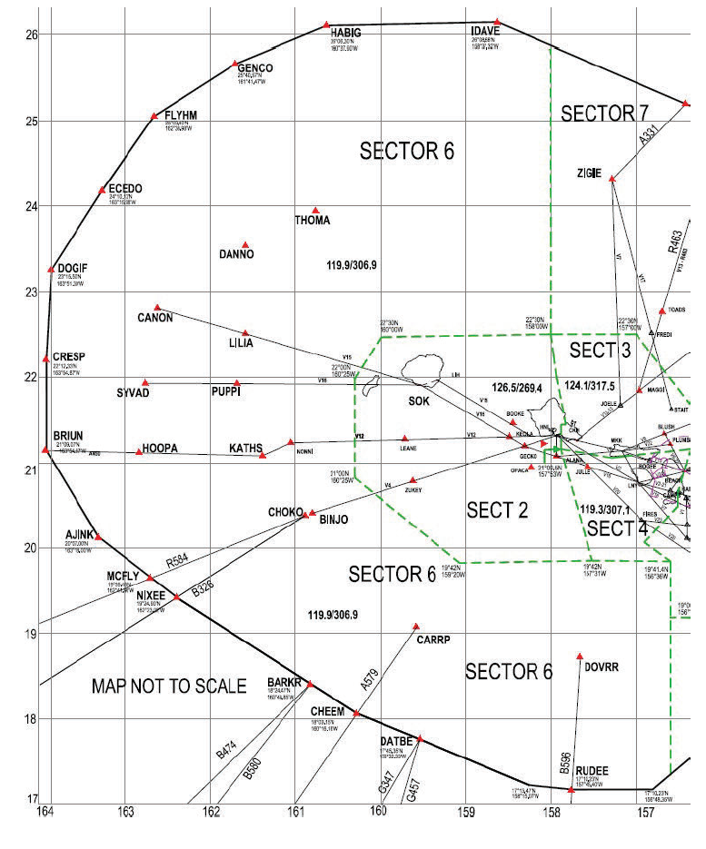
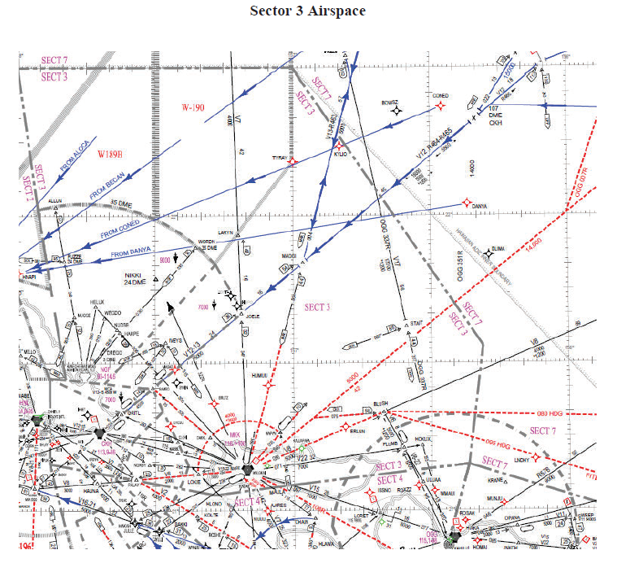
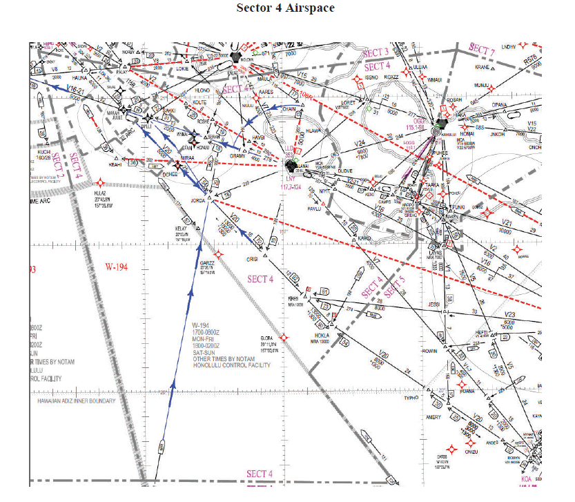
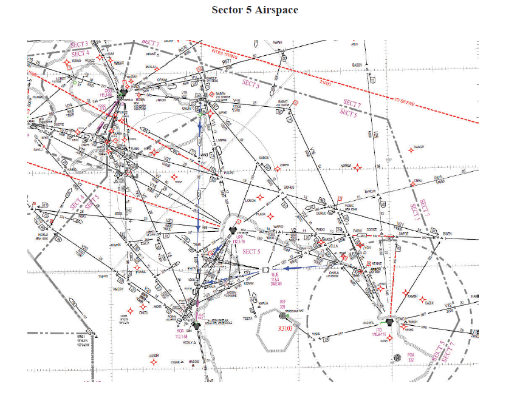
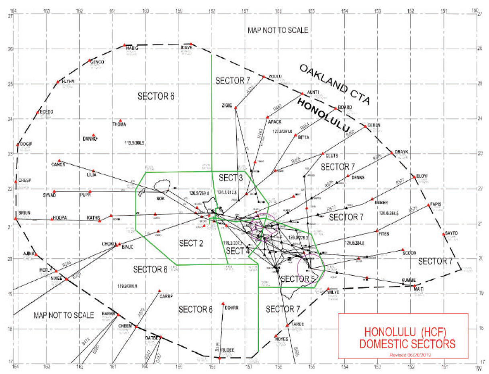

# 3. Sectors

## 3.1 - Sectors 2/6

### 3.1.1 - General

1. Sector Description: Sector 2/6 provides approach control services to Lihue Airport and Barking Sands Airport, Dillingham (HDH) and Port Allen (PAK) parachute operations in addition to enroute services in designated airspace. Secondary airports include Princeville (HI01) and Port Allen.

### 3.1.2 - Airspace

1. Sector 2/6 airspace is defined as on the chart and normally combined.
2. The vertical limit of Sector 2/6 is unlimited.
3. Provide air traffic services to Dillingham and Port Allen jump operations.
4. Approve or deny the delegation of the RWY 8L or 4R Extension airspace (8EXT/4EXT) when requested by HNL Approach. Altitude is 3,000’ for 8EXT and SFC-3,000’ for 4EXT unless otherwise coordinated.

## 3.2 - Sector 3

### 3.2.1 - General

1. Sector Description: Sector 3 provides approach control services to Molokai Airport, Kalaupapa Airport, and Kaneohe Airport (NGF approach closed). Secondary airports include HI49 (Panda Ranch).

### 3.2.2 - Airspace

### 3.2.3 - Coordination

1. To aid Sectors 4/5 the following reroutes are recommended.
   1. Aircraft inbound to HNL from FITES will be routed via FITES RV V12 HNL.
   2. Oceanic aircraft departing HNL to FITES/SCOON be rerouted via V8 BLUSH RV FITES/SCOON.
   3. OGG – HNL aircraft routed via V6 BLUSH RV V12 HNL.
2. Pilots requesting to depart from Kalaupapa Airport on an IFR flight plan via the Kalaupapa SID will call MKK Tower for clearance.
   1. MKK Tower will relay clearance and release instructions to the pilot and advise to contact HCF Center on 124.100 when climbing above 1,500’.
   2. Molokai Airport and Kalaupapa Airport should be treated as one airport when issuing departure clearances.

## 3.3 - Sector 4

### 3.3.1 - General

1. Sector Description: Sector 4 provides approach control services to Lanai airport and Kapalua airport in addition to enroute services in designates areas.

### 3.3.2 - Airspace

1. Approve or deny the delegation of the RWY 26L Extension Airspace (26EXT) when requested by HNL Approach. Altitude is 3,000’ unless coordinated otherwise.

## 3.4 - Sector 5

### 3.4.1 - General

1. Sector Description: Provide approach control services to Kona, Kamuela, Bradshaw, and Hana airports. Secondary airport includes Upolu. HCF has control of ITO airspace and frequencies from 0800-1600Z.

### 3.4.2 - Airspace

## 3.5 - Sector 7

### 3.5.1 - General

1. Sector Description: Sector 7 provides enroute services in designated airspace

### 3.5.2 - Airspace

### 3.5.3 - Coordination

1. To aid Sectors 4/5 the following reroutes are recommended.
   1. Aircraft inbound to HNL from FITES will be routed via FITES RV V12 HNL.
   2. Oceanic aircraft departing HNL to FITES/SCOON be rerouted via V8 BLUSH RV FITES/SCOON.
   3. OGG – HNL aircraft routed via V6 BLUSH RV V12 HNL.
