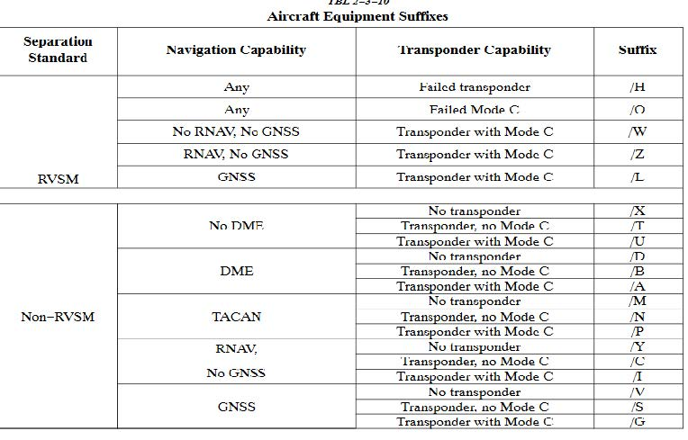
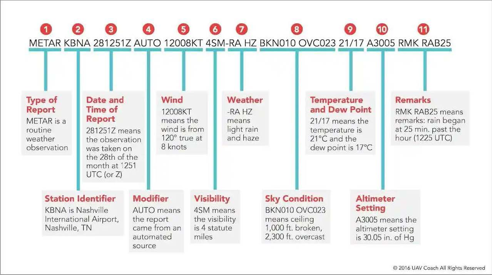
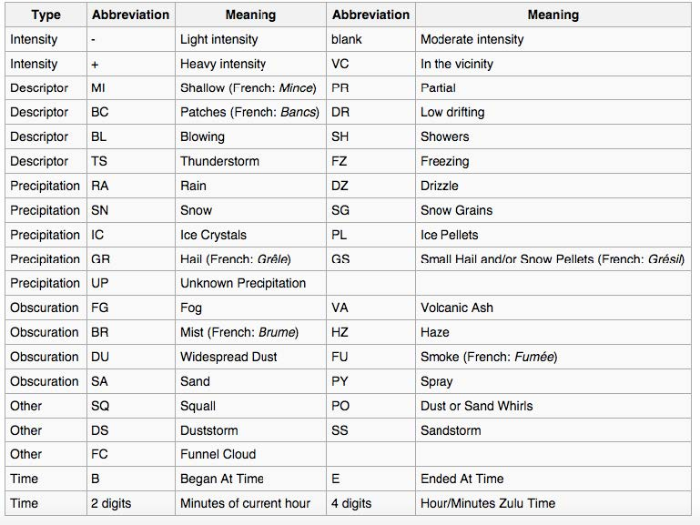

# 5. Student 1 Training

## 5.1 - S1 Lesson 1 – Setup

Client Setup

- The current software client for VATSIM USA is **CRC**. (<https://vnas.vatsim.net/crc>)
- The most commonly used client for Ground Control and Clearance Delivery is **Tower Cab** mode.
- To setup **CRC**, download from the URL listed above.
- Your Mentor/Instructor will provide further detail with you on setting up the client and learning how to connect.
- Set your Visibility range in accordance with [VATSIM Code of Conduct](https://vatsim.net/docs/policy/code-of-conduct). For ground this should be 20nm or less.
- In addition to **CRC**, you will also be instructed to download/use **vSTRIPS** and **vTDLS**.
- **vStrips** is a web-based simulation of the paper flight progress strips used by FAA controllers in air traffic control towers. The application is used alongside a primary controlling client, such as **CRC**. Controllers logged in to the same **vStrips** facility share a set of flight strip bays that auto-matically update whenever a controller adds, moves, edits, or deletes a flight strip.
- **vStrips** also offers a variety of features that mirror realistic workflows, including the ability to add separators between flight strips, create custom half-strips for temporary or VFR flight plans, and offset strips to the side of a rack.
- **vTDLS** is a high-fidelity simulation of the real-life FAA TDLS (Tower Data-Link Services) system that allows controllers to send pre-departure clearances (PDCs) to aircraft. **vTDLS** greatly reduces the workload of clearance-delivery controllers at equipped airports, particularly during departure-heavy events as it allows controllers to review flight plans and send PDCs to pilots before they even connect to the network.

## 5.2 - S1 Lesson 2 – Oral

**Airspace Information**

    Class E - Controlled airspace with only a transponder being required above C, above 10,000, and within a Class B mode C veil.
    Class D - Only two-way radio communication is needed. Only aircraft requesting radar services under approach control and IFR traffic need squawk codes.
    Class C - Aircraft are required to have a transponder and two-way radio communication. Most aircraft will be given a squawk code depending on direction, altitude, radar services, or intentions.
    Class B - Aircraft are required to have a clearance, transponder within the 30-mile mode C Veil, and two-way radio communication. All aircraft VFR or IFR will be given a squawk code.
    Class A - Aircraft are required to be on an IFR flight plan, clearance, transponder, and two-way radio communication.

**Clearance Information**

Clearances for IFR flight are given using the CRAFT acronym.

    Clearance Limit / Route of flight / Altitude / Frequency / Transponder Code.

Clearances for VFR operations in, out, or through Class B airspace is as follows. *"N123AB CLEARED THROUGH/TO ENTER/OUT OF BRAVO AIRSPACE"*

## 5.3 - S1 Lesson 3 – Oral

**Movement vs Non-Movement**

Movement area is areas on the airport such as taxiways and runways. These are areas that aircraft must have permission to move about, takeoff, or land on.

Non-Movement area is areas on the airport such as the terminal ramp, general aviation ramp, or military ramps. These are locations that aircraft can move about without permission from the controller.

**Taxi Information**

- Fixed Wing - These aircraft taxi about the normal way you see on an airport if you was flying on an airliner or flying with a friend. The correct way to issue a taxi clearance is *"FDX9260 Runway 4R taxi via C Altimeter 30.11" or "FDX9260 taxi to parking via C"*
  - Note that you do not have to give the altimeter if they call with the current ATIS or numbers.
- Helicopters - Helicopters have several ways they can taxi. They can surface taxi, hover taxi, or air taxi. However, helicopters will generally take off from present position.
  - Surface Taxi - Helicopters have wheels and would taxi like a normal aircraft.
  - Hover Taxi - When requested or necessary for a helicopter/ VTOL aircraft to proceed at a slow speed above the surface, normally below 20 knots and in ground effect, use the following phra-seology.
    - *"Helicopter N123AB runway 4R hover taxi via C"* If needed you can issue CAUTION (dust, blow-ing snow, loose debris, taxiing light aircraft, personnel, etc.).
  - Air Taxi - When requested or necessary for a helicopter to proceed expeditiously from one point to another, normally below 100 feet AGL and at airspeeds above 20 knots, use the following phra-seology.
    - *"Helicopter N123AB Air Taxi via (direct, as requested, or specified route) TO (location, heliport, helipad, operating/movement area, active/inactive runway) AVOID (aircraft/vehicles/person-nel). If required, REMAIN AT OR BELOW (altitude). CAUTION (wake turbulence or other reasons above). LAND AND CONTACT TOWER, or HOLD FOR (reason− takeoff clearance, release, land-ing/taxiing aircraft, etc.).”*

**RVSM Airspace**

Reduced vertical separation minima or minimum (RVSM) is the reduction, from 2,000 feet to 1,000 feet, of the standard vertical separation required between aircraft flying between flight level 290 (29,000 ft) and flight level 410 (41,000 ft). This reduction in vertical separation minima therefore increases the num-ber of aircraft that can fly in a particular volume of controlled airspace.

Aircraft must be RVSM capable to cruise between FL290 and FL410. Aircraft can cruise above FL410 non RVSM capable however, they cannot level off in RVSM airspace.

Above RVSM airspace separation will be 2,000 ft resulting in all cruising altitudes being odds alternating for direction of flight.

## 5.4 - S1 Lesson 4 – Oral

**Equipment Codes**

You will see an image attached with the most common/simple equipment suffixes that include both RVSM and non RVSM codes.

**Weather**

## 5.5 - S1 – Checklist

|   |   |
|---|---|
| CRC | - Can connect to CRC on an active position (Sweatbox) - Properly establish and communicate two-way radio communication |
| Weather | -Cloud Reporting - Can fully decode a METAR including: Station identification, Time obser-vation was made, Wind (including variable, guts), Altimeter setting, Tem-perature & Dew point (and explains relationship), Identified cloud types and when a ceiling is present - Properly decodes METAR and TAF |
| Clearance Delivery | - Can explain the parts of a flight plan - Clearance Information - RVSM Airspace - Equipment Codes - Issues clearances using prescribed phraseology - Identifies flight plan altitudes which do not correspond with NEODD/SWEVEN - Processes amendments to flight plan - Identifies errors in flight plans and corrects - Defines all parts of a clearance - Explains all types of SIDs - Defines what RVSM is and how it differs from normal direction of flight altitude rules - Defines all parts of a flight plan - Defines, compares and contrasts: /A, /G, /L and /Z equipment suffixes - Identifies, compares and contrasts at minimal the differences between VOR and area navigation. Ensures flight plans are in compliance with restrictions regarding navigation type by identifying /A, /G and /L - Issue VFR Class B clearance including discrete beacon code - Informs pilot of ATIS if they do not call in along with runway and altimeter setting as needed - Ensures read back is correct with prescribed phraseology - Clearance issuance - At least 90% of IFR clearances contain no errors - At least 90% of VFR clearances contain no errors - Read back and hear back is assured |
| Ground Control | - Movement vs non movement - Taxi Information - Defines movement and non-movement areas - Issues taxi instructions to an active runway utilizing prescribed phraseology - Issues taxi to a runway for an intersection departure using prescribed phraseology - Explains special significance of heavy/super - Ground movement - Arriving aircraft are taxied to requested destination IAW the standards 7110.65 - Departing aircraft are taxied to their runway IAW the standards 7110.65 - No runway incursions occur. No multiple runway crossings are issued - Aircraft are squawking altitude encoding prior to take-off - Proper sequencing is utilized including but not limited to departure sequencing, and proper give-way/follow instructions - Identifies floor/ceiling of class C airspace and requirements to operate within. - Identifies floor/ceiling for a class B airspace and requirements to operate within. Shows how B and C differ. - Identifies requirements to be in Class A airspace along with the floor and ceiling thereof |

## 5.6 - S1 Lesson 5 – Sweatbox

This lesson is a sweatbox scenario. The MTR/INS will run this session handling IFR and VFR traffic.

1. Demonstrates knowledge of Delivery and Ground Controller duties and responsibilities
   1. Defines all parts of a clearance.
   2. Explains all types of SIDs.
   3. Defines what RVSM is and how it is used on VATSIM.
   4. Defines all parts of a flight plan.
   5. Defines, compares, and contrasts /A, /G, and /L equipment suffixes.
   6. Identifies difference between movement and non-movement areas.
2. Clearance Issuance
   1. IFR Clearances are issued IAW the standard.
   2. VFR Clearances are issued IAW the standard.
3. Ground Movement
   1. Arriving aircraft are taxied to requested destination IAW the standard.
   2. Departing aircraft are taxied to their runway IAW the standard.
   3. No runway incursions occur.
   4. Runway Crossing are issued IAW the standard.
   5. Aircraft are squawking altitude encoding if required.
   6. Proper sequencing is utilized including but not limited to proper use of follow/behind.
   7. Helicopter ground movements are issued IAW the standard.

### 5.6.1 - Session Checklist Items

- Can connect to CRC on an active position (sweatbox)
- Properly establish and communicate two-way radio communication
- Can explain parts of the clearance
- Issues clearances using prescribed phraseology
- Identifies flight plan altitudes which do not correspond with NEODD/SWEVEN
- Identifies, compares and contrasts at minimal the differences between VOR and area Navigation
- Ensures flight plans are in compliance with restrictions regarding navigation type by identifying /A, /G and /L
- Issues VFR Class Bravo clearance including discrete beacon code
- Can fully decode a METAR including: Station identification, Time observation was made, Wind (including variable, gusts), Altimeter setting, Temperature & Dew point (and explains relation-ship), Identified cloud types and when a ceiling is present
- Processes amendments to flight plan
- Identifies errors in flight plans and corrects them
- Identifies four types of SIDs Defines pilot nav, radar nav and hybrid nav SIDs
- Ensures read back is correct with prescribed phraseology
- Informs pilot of ATIS if they do not call in with it along with runway and altimeter setting as needed
- Defines movement and non-movement areas
- Issues taxi instructions to an active runway utilizing prescribed phraseology
- Issues taxi to a runway for an intersection departure using prescribed phraseology

Upon Completion of the lessons and successful Sweatbox and LIVE sessions, the Instructor will issue S1 rating for all HCF facilities.
