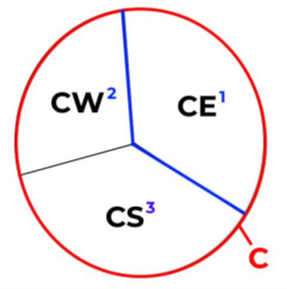
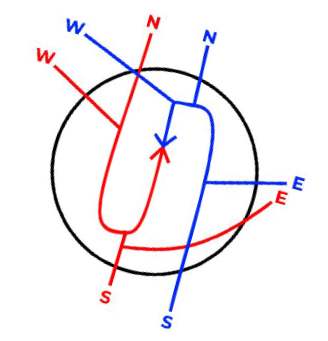

# Guam CERAP Facility Operating Procedures

??? info "Revision Info"
	- Document Number: ZUA 7110.1
	- Date: 01 Jan 2024
	- Revision Version: **A**
	- Editor: Dirk Thorben Kottenhahn, HCF FE

!!! warning "Outdated"
	The Guam CERAP FOP is heavily outdated and we are still waiting to receive proper information on how to improve it.

!!! abstract "Quick Reference"
	- IFR Departure Altitude: 4,000
	- VFR Altitude: AOB 4,000 
	- Missed Approach: 4,000 feet, runway heading or as coordinated with Radar

## Operational Positions
Bold designates Primary Position
### Center Positions
| **Position**    | **Name**   | **Call Sign** | **Frequency** |
|-----------------|------------|---------------|---------------|
| **Guam Center** | Guam Radar | GUM_CTR       | 118.700       |
| West Sector     | Guam Radar | GUM_W_CTR     | 127.800       |
| East Sector     | Guam Radar | GUM_E_CTR     | 120.500       |
| South Sector    | Guam Radar | GUM_S_CTR     | 128.450       |

### Guam International Positions
| **Position**           | **Name**      | **Call Sign** | **Frequency** |
|------------------------|---------------|---------------|---------------|
| **Guam East Approach** | Guam Approach | GUM_E_APP     | 119.800       |
| Guam West Approach     | Guam Approach | GUM_W_APP     | 118.300       |
| **Guam Tower**         | Guam Tower    | GUM_TWR       | 118.100       |
| **Guam Ground**        | Guam Ground   | GUM_GND       | 121.900       |
| Guam Ramp              | Guam Ramp     | GUM_RMP       | 121.600       |

### Andersen Air Force Base Positions
| **Position**           | **Name**          | **Call Sign** | **Frequency** |
|------------------------|-------------------|---------------|---------------|
| **Guam East Approach** | Guam Approach     | GUM_E_APP     | 119.800       |
| **Andersen Tower**     | Andersen Tower    | UAM_TWR       | 126.200       |
| **Andersen Ground**    | Andersen Ground   | UAM_GND       | 121.700       |
| **Andersen Delivery**  | Andersen Delivery | UAM_DEL       | 126.725       |

### Saipan International Positions
| **Position**        | **Name**        | **Call Sign** | **Frequency** |
|---------------------|-----------------|---------------|---------------|
| **Saipan Approach** | Saipan Approach | GUM_S_APP     | 118.400       |
| **Saipan Tower**    | Saipan Tower    | GSN_TWR       | 125.700       |
| **Saipan Ground**   | Saipan Ground   | GSN_GND       | 121.800       |

## Clearance Delivery
### IFR Departure Procedures
- If a radar controller presides over the delivery position, all IFR aircraft shall be given instructions to expect radar vectors to their initial fix.
- If no radar controller is present, all IFR aircraft shall be given instructions directly to their initial fix.
- All IFR aircraft receive initial altitude 4,000 feet

### VFR Departure Instructions
- VFR aircraft in the pattern at any field maintain VFR.
- VFR departing from any field maintain VFR AOB 4,000.

### Departure Frequency
| **Airport**    | **Operations** | **Frequency** |
|----------------|----------------|---------------|
| Guam (GUM)     | **East***      | 119.800       |
| Guam (GUM)     | West           | 118.300       |
| Saipan (SPN)   | **East***/West     | 118.400       |
| Andersen (UAM) | **East***/West     | 119.800       |

Bold/Asterix designates a primary runway configuration.

## Ground Control
### Responsibilities
- GC does not authorize pushbacks or startups unless the aircraft pushing back will enter a controlled area during a pushback.
- GC shall ensure that aircraft are squawking their assigned beacon code prior to the aircraft being handed off to Tower.
- GC shall ensure that aircraft are properly sequenced by their direction of travel and A/C type.
- GC shall ensure that all RWY crossings are coordinated with LC unless blanket crossings are in effect.

### GC/LC Transfer of Control
- During normal or light traffic, aircraft shall be instructed to contact LC.
- During high traffic, aircraft shall be instructed to monitor the LC frequency when requested by LC.
	- GC shall either point out aircraft to LC when a pilot was given the monitor instruction.
	- Or GC may push a flight strip to LC.

## Local Control
### Responsibilities
- LC is responsible for aircraft operating on all runways and aircraft operating within these designated LC controlled areas:
	- Guam Airport
		- All aircraft operating in-between both of the parallel runways shall maintain radio communication with LC, until a condition is met for a verbal handoff to occur.
		- Aircraft exiting the runway on taxiway J shall maintain radio communication with LC, unless coordinated otherwise with GC.
	- Andersen Air Force Base
		- All aircraft operating in-between both of the parallel runways shall maintain radio communication with LC, until a condition is met for a verbal handoff to occur.
	- Saipan Airport
		- All aircraft operating in-between both of the parallel runways on taxiways: B, D, and E, shall maintain radio communication with LC, until a condition is met for a verbal handoff to occur.
- Do not land or depart on runways with a tailwind component of more than 10 knots.
- LC must coordinate runway configuration changes with RADAR and GC, and must notify of the last departures from the prior configuration. LC must wait for RADAR notification of readiness before executing the new runway configuration.
- LC will not track or radar identify any departures or arrivals. None of the fields in the Guam CERAP are radar towers.
- Special VFR operations are prohibited.

### Departure Procedures
- LC receives automatic departure releases from RADAR for all IFR departures, unless coordinated otherwise. LC must provide RADAR with rolling calls.
- LC will verbally hand off aircraft off to RADAR once the aircraft establishes a positive rate through 500ft. MSL.
- LC will ensure that all IFR aircraft are handed off to RADAR no later than 1/2 mile off the end of the departure runway.
- LC at all fields own a 3-mile radius ( UAM: 4-miles ) from the center of the field. All VFR departures shall remain with LC until leaving this initial airspace, and verbally handed off to the respective frequencies

### Arrival Procedures
- Communication transfer must be completed prior to five nautical miles from the runway.
- LC shall provide VFR arrivals with entry instructions into the pattern and field altimeter.
- Land and Hold Short (LAHSO), and Line Up and Wait (LUAW) are NOT authorized at any Guam CERAP field

### Missed Approaches Go-Arounds
- At all Guam CERAP fields, assign runway heading, and climb to 4,000.
- Coordinate with RADAR for alternative headings / altitudes then handoff to RADAR.
- Do not assign the published missed approach procedure unless it is requested or approved by RADAR.

### Closed Traffic
| **Airport**  | **Runway** | **Direction** |
|--------------|------------|---------------|
| GUM/UAM      | 6L         | Left          |
| GUM/UAM      | 6R         | Right         |
| Saipan (SPN) | 6          | Left          |
| Saipan (SPN) | 7          | Right         |

All operations are noted in main configuration. The direction is "flipped" when the configuration is changed.

## Radar Control
The Guam CERAP consists of two main terminal radar sectors. The following explain each area, and their airspace.

### Guam Approach
- The Guam Approach which consists of GE and GW and establishes control over the Guam Airport and the Andersen Air Force Base.
	- Final operations in normal configuration for the fields are with GW, and are flipped when West flow is used.
- The Guam Approach consists of two main MVAs, the main one which covers both GUM and UAM has a floor of 023 (2,300). The other MVA is located on the southern part of Guam island, and has a floor of 026 (2,600).
- Both Guam Airport and Andersen Air Force Base should mirror the same runway operations; as they are 8 miles separated, and proper sequencing and separation needs to be applied for approaches into the fields.
	- If one airport switches operations, the other should be advised to do so within a 10 to 20 minute timeframe.
- Departures from both of these fields should be vectored onto a single stream for the directions: north, south, east, and west.

### Saipan Approach
- The Saipan Approach which consists of GS has control over Tinian Airport and Saipan Airport.
- The Saipan Approach holds one MVA over the two islands in the airspace that has a floor of 028 (2,800).
- There are no special rules for the 8-mile spacing of Tinian and Saipan. Though it is recommended that these airports mirror the same flow operations, yet is not mandatory.
- Departures from both of these fields should be vectored onto a single stream for the directions: north, south, east, and west.
- The Tinian Airport is uncontrolled, and therefore the One-In/One-Out rule must be applied for this field.

### Handoffs
- None of the fields are radar towers, so no Radar Handoffs to LC should be done.
- Departing IFR and VFR Flight Following aircraft shall be Radar handed off to the appropriate Center Controller once reaching the boundaries of the respected radar area, and clear of conflict

### VFR Aircraft
- VFR aircraft operating within either of the Class D airspace, or Andersen TRSA shall be kept at or below 4,000 feet.
- VFR aircraft arriving into Saipan, Andersen, or Guam will not receive pattern instructions, but must be provided with the field Altimeter, and verbally handed off to Local Control prior to entering the LC airspace.

### Departure Releases
- All fields are allotted automatic departure releases unless otherwise coordinated. The LC shall provide RADAR with rolling calls containing the following:
	- Aircraft Callsign
	- Initial Fix
	- Departure Runway

### Missed Approaches/Go-Arounds
- LC shall provide all missed approach aircraft runway heading and instructions to maintain 4,000.
- LC shall coordinate with RADAR for alternative headings / altitudes prior to the aircraft being handed off.
- LC is instructed to not assign published missed approach procedures unless requested or approved by RADAR.
- RADAR is responsible for the separation of missed approach aircraft re-entering the approach into the field.
- RADAR is NOT responsible for VFR aircraft declaring the missed approach.

### In-Trail Spacing
- RADAR shall ensure that aircraft have at least 3 miles in lateral separation, and 1,000 feet in vertical separation prior to being handed off to LC.
- CENTER shall ensure that aircraft have at least 5 miles in lateral separation prior to being handed off to RADAR.

### Departure Flows
- IFR aircraft departing one of the controlled fields shall be given a vector out of the radar area, and provide CENTER with a single-stream flow for the directions: north, south, east, and west.
- VFR Flight-Following aircraft departing one of the controlled fields shall be given directional instructions, or the arrangement of the following:
	- **Departing Guam Island**: follow the coastline east/west/south.
	- **Departing Saipan Island**: follow the coastline north/south.

### Arrival Flows
- IFR aircraft arriving into one of the controlled fields shall be given an altimeter and expected runway and approach.
- VFR Flight-Following aircraft arriving into one of the controlled fields shall be given directional instructions, and an altimeter prior to being handed off to LC.

## Center Control
### Sectors
- When not split, all aircraft in the Guam CERAP shall be handed off from RADAR to C on fre-quency 118.700.
- When split two-ways, all aircraft departing the Saipan Approach shall be handed off to CE on 120.500, and aircraft departing the Guam Approach shall be handed off to CW on 127.800.
- When split three-ways, all aircraft departing the Saipan Approach, and aircraft departing North or East from Guam, shall be handed off to CE, and aircraft departing Guam Approach to the west shall be handed off to CW, and departing southbound respectively to CS on frequency 128.450.

	

- All aircraft in the Guam Center airspace should have 5 miles in trail below flight level 600, down to 3 miles prior to entering the radar areas (Saipan/Guam).
- All IFR aircraft handed off from RADAR will be on a single stream in the north, south, east, and west-bound directions.
- All IFR aircraft handed off from the situations above shall be vectored onto their respective air-ways as stated in their flight plans
- For both Saipan and Guam radar arrivals; all IFR aircraft should be vectored onto either a left or right extended downwind pertaining to the runway configuration. This is only an example of aircraft from the north, south, east, and west; and is determined by coordination with the RADAR and CENTER controllers.

	

### Handoffs
- All IFR aircraft, or VFR Flight-Following aircraft arriving into the controlled airspace of the Guam and Saipan radar areas shall be Radar handed-off provided all conditions are met.
- All IFR aircraft <ins>departing</ins> the Guam CERAP airspace shall be coordinated with the Oakland Oceanic airspace as followed:
	- Upon verbally handed off the aircraft to the Oakland Oceanic, you must then request a clearance with FSS with the following information:
		- Callsign
		- Transfer Control Point (TCP) or Route Number
		- Cruise Altitude
		- Estimated Time to cross TCP or CERAP Boundary
	- Upon approval CENTER needs to sequence control and turnover the aircraft to not arrive before the clearance time.
	- If the aircraft's time of turnover newly exceeds over 5 minutes from the clearance time, CENTER must request a revised clearance as so:
		- **To FSS:** "(callsign), was (TCP/RN) (original time), now (revised time request)."
	- Once the aircraft has been given clearance into the Oakland Oceanic airspace: CENTER shall instruct the aircraft the following 5 to 10 minutes prior to the TCP.
		- **To Pilot:** "(callsign), entering the Oceanic airspace, squawk 2000, radar services terminated, report position to San Francisco Radio on (frequency)."
- All IFR aircraft entering the Guam CERAP airspace shall have proper coordination with the Oakland Oceanic airspace as followed:
	- Per request, and optional, the Guam CERAP may request the FSS to notify of aircraft ex-iting the FSS into Guam, and including a time of control transfer.
	- The FSS shall transfer control of aircraft 15 minutes prior to the TCP, but CENTER may request control earlier if the aircraft is radar identified; as such:
		- **To FSS:** "(callsign), request control."
		- To facilitate radar identification, CENTER may pass a beacon code to the FSS to give to a specific aircraft.

### Uncontrolled Field Operations
- The Rota (or Manglona / PGRO) airport is the only field in the Guam CERAP that is not covered by radar services from Guam or Saipan Approach.
- Rota airport has several non-precision approaches for IFR aircraft. This airport has an application of the One-In/One-Out rule for IFR aircraft, and no services are provided on the ground for VFR aircraft.
- Rota airport has a surrounding MVA with a floor of 029 (2,900), and any aircraft requesting Pop-Up IFR services must be climbed above this MVA.
