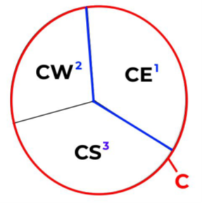
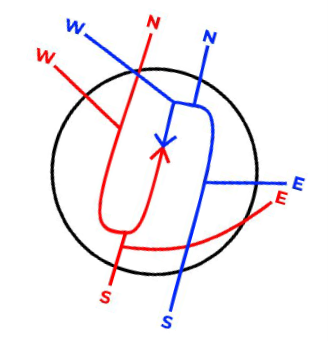

# 6. Center Control

## Sectors

- When not split, all aircraft in the Guam CERAP shall be handed off from RADAR to C on fre-quency 118.700.
- When split two-ways, all aircraft departing the Saipan Approach shall be handed off to CE on 120.500, and aircraft departing the Guam Approach shall be handed off to CW on 127.800.
- When split three-ways, all aircraft departing the Saipan Approach, and aircraft departing North or East from Guam, shall be handed off to CE, and aircraft departing Guam Approach to the west shall be handed off to CW, and departing southbound respectively to CS on frequency 128.450.

- All aircraft in the Guam Center airspace should have 5 miles in trail below flight level 600, down to 3 miles prior to entering the radar areas (Saipan/Guam).
- All IFR aircraft handed off from RADAR will be on a single stream in the north, south, east, and west-bound directions.
- All IFR aircraft handed off from the situations above shall be vectored onto their respective air-ways as stated in their flight plans
- For both Saipan and Guam radar arrivals; all IFR aircraft should be vectored onto either a left or right extended downwind pertaining to the runway configuration. This is only an example of aircraft from the north, south, east, and west; and is determined by coordination with the RADAR and CENTER controllers.

## Handoffs

- All IFR aircraft, or VFR Flight-Following aircraft arriving into the controlled airspace of the Guam and Saipan radar areas shall be Radar handed-off provided all conditions are met.
- All IFR aircraft <ins>departing</ins> the Guam CERAP airspace shall be coordinated with the Oakland Oceanic airspace as followed:
  - Upon verbally handed off the aircraft to the Oakland Oceanic, you must then request a clearance with FSS with the following information:
    - Callsign
    - Transfer Control Point (TCP) or Route Number
    - Cruise Altitude
    - Estimated Time to cross TCP or CERAP Boundary
  - Upon approval CENTER needs to sequence control and turnover the aircraft to not arrive before the clearance time.
  - If the aircraft's time of turnover newly exceeds over 5 minutes from the clearance time, CENTER must request a revised clearance as so:
    - **To FSS:** "(callsign), was (TCP/RN) (original time), now (revised time request)."
  - Once the aircraft has been given clearance into the Oakland Oceanic airspace: CENTER shall instruct the aircraft the following 5 to 10 minutes prior to the TCP.
    - **To Pilot:** "(callsign), entering the Oceanic airspace, squawk 2000, radar services terminated, report position to San Francisco Radio on (frequency)."
- All IFR aircraft entering the Guam CERAP airspace shall have proper coordination with the Oakland Oceanic airspace as followed:
  - Per request, and optional, the Guam CERAP may request the FSS to notify of aircraft ex-iting the FSS into Guam, and including a time of control transfer.
  - The FSS shall transfer control of aircraft 15 minutes prior to the TCP, but CENTER may request control earlier if the aircraft is radar identified; as such:
    - **To FSS:** "(callsign), request control."
    - To facilitate radar identification, CENTER may pass a beacon code to the FSS to give to a specific aircraft.

## Uncontrolled Field Operations

- The Rota (or Manglona / PGRO) airport is the only field in the Guam CERAP that is not covered by radar services from Guam or Saipan Approach.
- Rota airport has several non-precision approaches for IFR aircraft. This airport has an application of the One-In/One-Out rule for IFR aircraft, and no services are provided on the ground for VFR aircraft.
- Rota airport has a surrounding MVA with a floor of 029 (2,900), and any aircraft requesting Pop-Up IFR services must be climbed above this MVA.