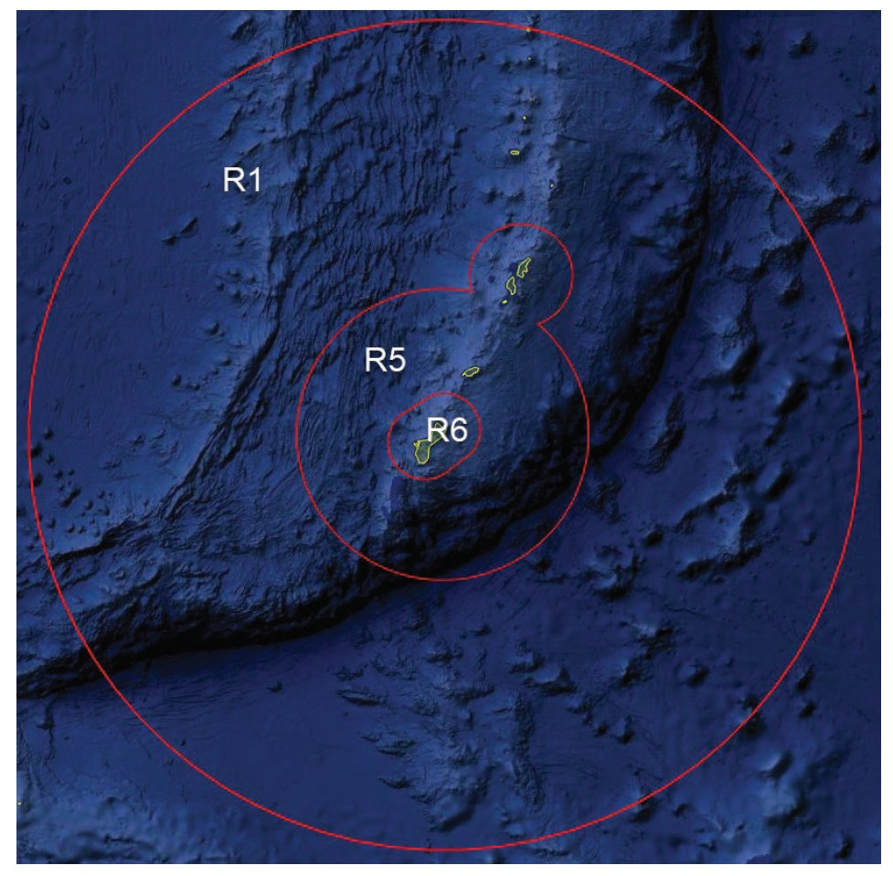

# 5. Center Control

## 5.1 - Sectors

### 5.1.1 - R1 - Oceanic Radar

1. Airspace: That airspace from the surface to unlimited within a 250NM radius of the Mt. Santa Rosa radar site, excluding that airspace delegated to Sector R5 and Sector R6
2. Operates Frequency 118.700

### 5.1.2 - R5 - Domestic En-Route Radar

1. Airspace: That airspace from the surface up to and including FL280 within a 100NM radius of the UNZ VORTAC which excludes Sector R6. Also, that airspace from the surface up to and including 14,000 feet MSL with a 35NM radius of the SN Radio beacon which excludes the airspace within 100NM of UNZ.
2. Operates Frequency 118.900
3. Provides approach control services to PGSN, PGWT and PGRO airport

### 5.1.3 - R6 - Terminal Radar

1. Airspace: That airspace up to and including 9,000 feet MSL within an area beginning at 1358N/14446E, along the 25NM arc east of the UAM TACAN to 1314N/14510E, direct to 1306N/14457E, along the 25NM arc west of the UNZ VORTAC to 1350N/14433E direct to the point of beginning.
2. Operates Frequency 120.500
3. Provides approach control services to airports within the sector

## 5.2 - In-Trail Spacing

1. All aircraft in the Guam Center airspace should have 5 miles in trail below flight level 600.
2. 3 miles spacing can be used in the airspace from surface up to and including 23,000 feet MSL within a 39 NM radius of the Mt. Santa Rosa radar site

## 5.3 - Departure Flows

1. R5 will climb aircraft that will exit the lateral boundary of Sector R5 within 100NM of UNZ to their filed altitude or FL280, whichever is lower.
2. R5 will climb aircraft that will exit the lateral boundary of Sector R5 within 35NM of SN NDB into Sector R1 airspace to 14,000 feet MSL or their filed altitude, whichever is lower.
3. R6 will assign departing aircraft their filed altitude or 9,000 feet MSL, whichever is lower, or as coordinated, prior to radar handoff

## 5.4 - Arrival Flows

1. R1 will descend all GUM/UAM arriving aircraft above FL290 to FL290 prior to hand-off. The issuance of a pilot’s discretionary descent is authorized.
2. R1 will descend all GSN arriving aircraft to 15,000 feet MSL prior to initiating radar hand-off. The issuance of a pilot’s discretionary descent is authorized.
3. R5 will descend GUM/UAM arriving traffic to 10,000 feet MSL. Traffic below 10,000 feet MSL should remain at their highest filed/requested altitude prior to radar handoff.

## 5.5 - Handoffs

1. All IFR aircraft, or VFR Flight-Following aircraft arriving into the controlled airspace of the Guam and Saipan radar areas shall be Radar handed-off provided all conditions are met.
2. All IFR aircraft <ins>departing</ins> the Guam CERAP airspace shall be coordinated with the Oakland Oceanic airspace as followed:
   1. Upon verbally handed off the aircraft to the Oakland Oceanic, you must then request a clearance with FSS with the following information:
      1. Callsign
      2. Transfer Control Point (TCP) or Route Number
      3. Cruise Altitude
      4. Estimated Time to cross TCP or CERAP Boundary
   2. Upon approval CENTER needs to sequence control and turnover the aircraft to not arrive before the clearance time.
   3. If the aircraft's time of turnover newly exceeds over 5 minutes from the clearance time, CENTER must request a revised clearance as so:
      1. **To FSS:** "(callsign), was (TCP/RN) (original time), now (revised time request)."
   4. Once the aircraft has been given clearance into the Oakland Oceanic airspace: CENTER shall instruct the aircraft the following 5 to 10 minutes prior to the TCP.
      1. **To Pilot:** "(callsign), entering the Oceanic airspace, squawk 2000, radar services terminated, report position to San Francisco Radio on (frequency)."
3. All IFR aircraft entering the Guam CERAP airspace shall have proper coordination with the Oakland Oceanic airspace as followed:
   1. Per request, and optional, the Guam CERAP may request the FSS to notify of aircraft ex-iting the FSS into Guam, and including a time of control transfer.
   2. The FSS shall transfer control of aircraft 15 minutes prior to the TCP, but CENTER may request control earlier if the aircraft is radar identified; as such:
      1. **To FSS:** "(callsign), request control."
      2. To facilitate radar identification, CENTER may pass a beacon code to the FSS to give to a specific aircraft.

## 5.6 - Uncontrolled Field Operations

1. The Rota (or Manglona / PGRO) airport is the only field in the Guam CERAP that is not covered by radar services from Guam.
2. Rota airport has several non-precision approaches for IFR aircraft. This airport has an application of the One-In/One-Out rule for IFR aircraft, and no services are provided on the ground for VFR aircraft.
3. Rota airport has a surrounding MVA with a floor of 029 (2,900), and any aircraft requesting Pop-Up IFR services must be climbed above this MVA.