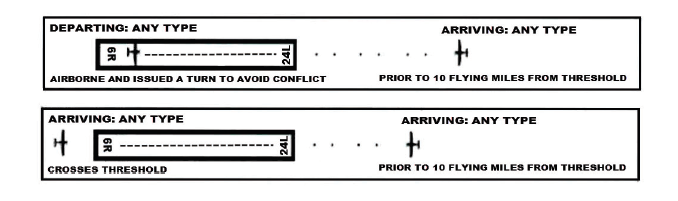
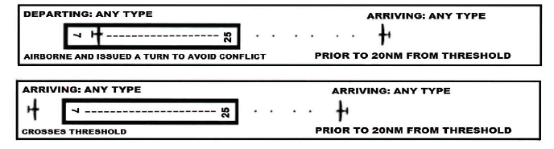

# 4. Local Control

## 4.1 - Responsibilities

1. LC is responsible for aircraft operating on all runways and aircraft operating within these designated LC controlled areas:
   1. **Guam Airport**
      1. All aircraft operating in-between both of the parallel runways shall maintain radio communication with LC, until a condition is met for a verbal handoff to occur.
      2. Aircraft exiting the runway on taxiway J shall maintain radio communication with LC, unless coordinated otherwise with GC.
      3. Request release for all IFR/SVFR departures. Ensure that the aircraft is airborne within three (3) minutes of the release time.
   2. **Andersen Air Force Base**
      1. All aircraft operating in-between both of the parallel runways shall maintain radio communication with LC, until a condition is met for a verbal handoff to occur.
   3. **Saipan Airport**
      1. All aircraft operating in-between both of the parallel runways on taxiways: B, D, and E, shall maintain radio communication with LC, until a condition is met for a verbal handoff to occur.
      2. LC must request release of all IFR departures and Special VFR aircraft departing the Saipan Class D surface area. Ensure that the aircraft is airborne within three (3) minutes of the release time.
2. Do not land or depart on runways with a tailwind component of more than 10 knots.
3. LC must coordinate runway configuration changes with RADAR and GC, and must notify of the last departures from the prior configuration. LC must wait for RADAR notification of readiness before executing the new runway configuration.
4. LC will not track or radar identify any departures or arrivals. None of the fields in the Guam CERAP are radar towers.

## 4.2 - Departure Procedures

1. LC will provide separation for aircraft in the LC airspace.
2. LC shall provide initial “radar” separation between all successive departures.
3. LC receives automatic departure releases from RADAR for all IFR departures, unless coordinated otherwise. LC must provide RADAR with rolling calls.
4. LC shall advise aircraft to squawk mode Normal prior to being handed off to the respective departure frequency.
5. LC will verbally hand off aircraft off to RADAR once the aircraft establishes a positive rate through 500ft. MSL.
6. LC will ensure that all IFR aircraft are handed off to RADAR no later than ½ mile off the end of the departure runway.
7. LC at all fields own a 3-mile radius ( UAM: 4-miles ) from the center of the field. All VFR departures shall remain with LC until leaving this initial airspace, and verbally handed off to the respective frequencies (refer to 2.4).

## 4.3 - Arrival Procedures

1. LC shall be responsible for separation of all arrival aircraft that have been handed off by RADAR from all departing aircraft under LC jurisdiction.
2. LC shall be responsible for separation of all operating IFR aircraft under LC jurisdiction from all operating VFR aircraft within the respective LC airspaces.
3. Communication transfer must be completed prior to five nautical miles from the runway.
4. LC shall provide VFR arrivals with entry instructions into the pattern and field altimeter.
5. Land and Hold Short (LAHSO), and Line Up and Wait (LUAW) are NOT authorized at any Guam CERAP field

## 4.4 - Missed Approaches Go-Arounds

1. At all Guam CERAP fields, assign runway heading, and climb to 4,000.
2. Coordinate with RADAR for alternative headings / altitudes then handoff to RADAR.
3. Do not assign the published missed approach procedure unless it is requested or approved by RADAR.

## 4.5 - Closed Traffic

| **Airport**  | **Runway** | **Direction** |
|--------------|------------|---------------|
| GUM/UAM      | 6L         | Left          |
| GUM/UAM      | 6R         | Right         |
| Saipan (SPN) | 6          | Left          |
| Saipan (SPN) | 7          | Right         |

All operations are noted in main configuration. The direction is "flipped" when the configuration is changed.

## 4.6 - "Contact" vs. "Monitor" Operations

1. During periods of high traffic, LC may request GC to instruct aircraft to monitor instead of contact LC.
2. When these operations are in effect, GC shall utilize the radar client’s “point out” feature to the appropriate LC controller for their field to notify LC when a pilot has been given the monitor instruction.
3. Alternatively, if agreed upon between the GC and LC controllers, GC may push a flight strip to the LC controller.

## 4.7 - Opposite Direction Operations

### 4.7.1 - Guam International Airport and Andersen Air Force Base

1. A departing aircraft, including an aircraft performing a touch-and-go or stop-and-go must be airborne and issued a turn to avoid conflict prior to an aircraft reaching:
   1. A point **10 flying miles** from the threshold of the runway or intended landing, unless an emergency exists; or
   2. If an aircraft is established in the RADAR traffic pattern, prior to that aircraft turning base leg, unless an emergency exists.
2. An aircraft performing a go-around, low approach, or missed approach must be issued a turn to avoid conflict prior to an aircraft reaching:
   1. A point **10 flying miles** from the threshold of the runway or intended landing, unless an emergency exists; or
   2. If an aircraft is established in the RADAR traffic pattern, prior to that aircraft turning base leg, unless an emergency exists.
3. An arriving aircraft must cross the runway threshold prior to an aircraft reaching:
   1. A point **10 flying miles** from the threshold of the runway or intended landing, unless an emergency exists; or
   2. If an aircraft is established in the RADAR traffic pattern, prior to that aircraft turning base leg, unless an emergency exists.
4. Traffic advisories must be issued to aircraft conducting opposite direction operations and must include aircraft type, location and the phrase “OPPOSITE DIRECTION.”

### 4.7.2 - Saipan Airport

1. Responsibilities:
   1. Guam CERAP Radar Controller and Saipan FCT Local Control share the responsibilities to coordinate the ODO and issue traffic advisories as prescribed in this section.
   2. Guam CERAP is responsible for ensuring all cutoff points are met.
2. Procedures for aircraft receiving IFR services:
   1. General:
      1. These procedures are applicable only when Guam CERAP radar is operational and under these procedures RY 7/25 and RY 6/24 are considered same runway.
      2. ODO procedures are applicable when two aircraft will execute approaches to opposite ends of the same runway, or an aircraft will depart prior to an arrival on an opposite direction approach to the same runway.
      3. Traffic advisories must be issued to both aircraft.
         1. **EXAMPLE** - “OPPOSITE DIRECTION TRAFFIC (distance) MILE FINAL, (type aircraft).“; “OPPOSITE DIRECTION TRAFFIC DEPARTING RUNWAY (number), (type aircraft).“
      4. Do not allow opposite direction same runway operations with opposing traffic inside the cutoff point unless an emergency situation exists.
      5. Use of visual separation is not authorized for aircraft receiving IFR services that are conducting ODO to the same runway.
   2. Coordination:
      1. Saipan FCT Local Control and Guam CERAP are responsible for initiating coordination required to accomplish an opposite direction arrival or departure.
      2. Saipan FCT must verbally request opposite direction departures with Guam CERAP.
      3. Guam CERAP must verbally request opposite direction arrivals with Saipan FCT.
      4. Initial Coordination must be on a recorded line and must state, “Opposite Direction,” and include call sign, type and arrival or departure runway.
      5. All subsequent coordination must be on a recorded line and must state, “Opposite Direction.”
   3. Cutoff Procedures: For aircraft receiving IFR services and conducting opposite direction same runway operations:
      1. Between an IFR arrival aircraft and an IFR departure aircraft: ensure the departing aircraft is airborne and turned to avoid all conflicts prior to the arrival aircraft reaching the 20NM cutoff point from the airport, unless an emergency exists.
      2. Between an IFR arrival aircraft and another IFR arrival aircraft: ensure the first arrival has crossed the runway threshold prior to the second aircraft reaching the 20NM cutoff point from the airport, unless an emergency exists.
      3. If the above conditions are not met, action must be taken to ensure control instructions are issued to protect the integrity of the cutoff points.
3. For VFR aircraft that are conducting opposite direction operations to the same or parallel runways:
   1. Ensure all departing VFR aircraft are issued a turn to avoid conflict with opposing IFR/VFR traffic.
   2. Traffic advisories are issued to both aircraft.
   3. State the phrase “opposite direction” if coordination is required.

