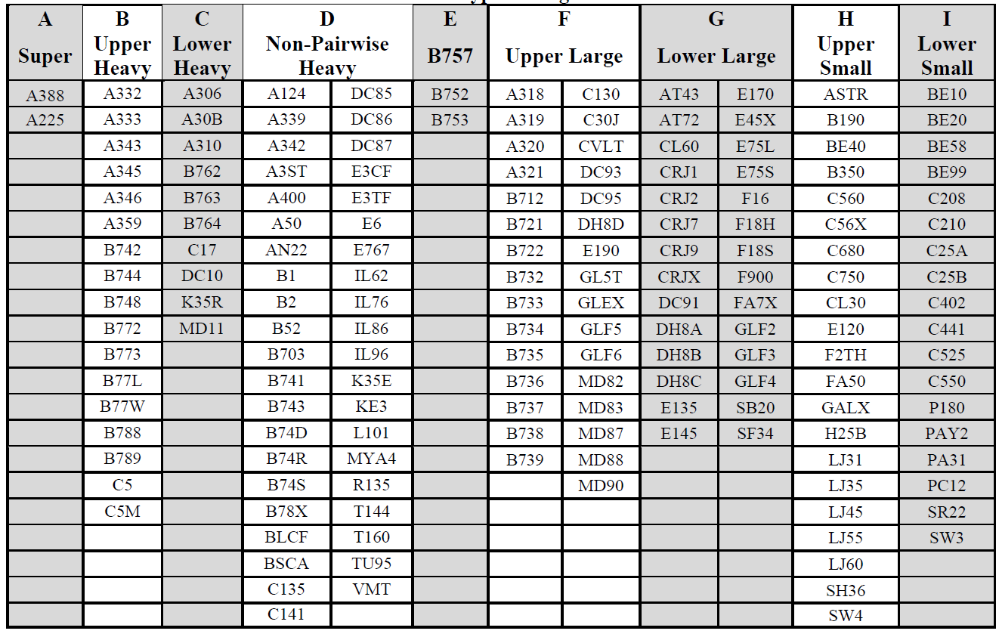
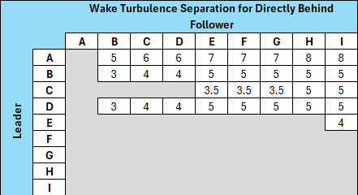
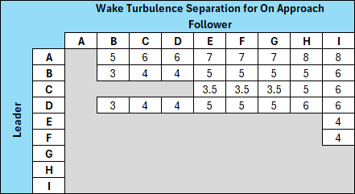
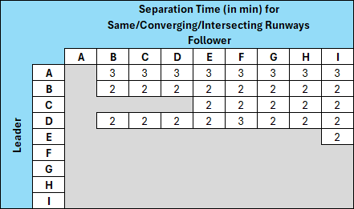
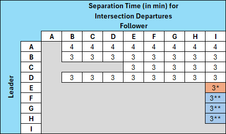

# Consolidated Wake Turbulence

!!! info "Revision Info"
    - Document Number: HCF 7110.4
    - Date: 13 Nov 2025
    - Revision Version: **A**
    - Editor: Dirk Thorben Kottenhahn, HCF FE

## Aircraft Wake Categories

Category A - A388 and A225.
Category B - Pairwise Upper Heavy aircraft.
Category C - Pairwise Lower Heavy aircraft.
Category D - Non-Pairwise Heavy aircraft.
Category E - B757 aircraft.
Category F - Upper Large aircraft excluding B757 aircraft.
Category G - Lower Large aircraft.
Category H - Upper Small aircraft with a maximum takeoff weight of more than 15,400 pounds up to 41,000 pounds.
Category I - Lower Small aircraft wth a maximum takeoff weight of 15,400 pounds or less.

This lists the most common aircraft for all Wake Categories, and is not an all-inclusive list. However, aircraft automation databases list all aircraft that have been assigned an aircraft type designator. Entering the appropriate aircraft type designator will allow automation systems such as Standard Terminal Automation Replacement System (STARS) and Airport Surface Detection Equipment Model X (ASDE-X) to display the appropriate aircraft wake turbulence category for all assigned aircraft.

## Procedures

1. The word *Super* must be used as part of the identification in all communications with or about Category A aircraft.
2. The word *Heavy* must be used as part of the identification in all communications with or about Category B, C, or D aircraft.

## CWT Quick Reference Cards for Radar

Numbers (distances) indicate required *Wake Turbulence Separation*, e.g. B following B requires 3NM Wake Turbulence Separation.

No number indicates no required Wake Turbulence Separation. However, some form of separation must be applied. (e.g. Radar separation, passing/diverging, etc).

Note that the term "on approach" means that the separation between the trailing aircraft and the leading aircraft will exist at the time the leading aircraft is over the landing threshold.

## CWT Quick Reference Cards for Non-Radar

- .* The same runway or a parralel runway separated by less than 700 ft and parallel runways separated by 700 feet or more, or parallel runways separated by 700 feet or more with the runway thresholds offset by 500 feet or more, if projected flight paths will cross.
- .** The same runway.
