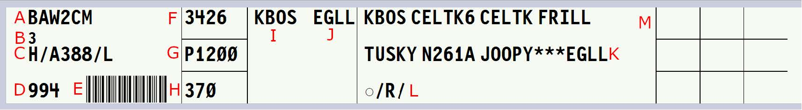

# Flight Strip Marking

!!! info "Revision Info"
    - Document Number: HCF 7110.3
    - Date: 01 Jan 2025
    - Revision Version: **B**
    - Editor: Dirk Thorben Kottenhahn, HCF FE

## Record of Revisions

| Version | Date | Revision | Editor |
|:---:|:---:|:---:|:---:|
| A | 01 Jan 2024 | Initial Release | Dirk Thorben Kottenhahn |
| B | 01 Jan 2025 | Move to Mkdocs | Dirk Thorben Kottenhahn |

## 1 - General

Strip Marking is required for all staffed ATCT positions. Strip marking is required for TRACON/RAPCON working ATCT positions top down on a traffic workload permitting basis only.

ZHN/ZUA Sectors covering ATCTs top down are not required to use strip marking.

In general, the annotation boxes and their information are both for IFR and VFR aircraft. Boxes that have a (VFR) marking are for VFR aircraft only.

vStrips uses a slightly different layout than the FAA Flight Strips, difference are with Block 8 and 9, oth-erwise they are nearly the same:

## 2 - ATCT Departures

| Field | Description |
|:---:|:---|
| A | Aircraft ID/Callsign |
| B | Revision Number |
| C | Equipment |
| D | CID |
| E | Barcode |
| F | Beacon Code/Squawk |
| G | Proposed departure time |
| H | Filed cruise altitude |
| I | Departure Airport |
| J | Destination Airport |
| K | Route (*** displayed when truncated) |
| L | Remarks (*** displayed when truncated) |
| M | Annotation Boxes 1-9 (from left to right, top to bottom), compare to FAA flight strip boxes 10-18 (10 being box 1 here and 18 being box 9 here) |

**Marking of Annotation Boxes:**

- Clearance Delivery
    - Box 1: Letter of reported ATIS if initial radio communication is established
    - Box 4: “PDC” if PDC is issued successfully; “X” to indicate a correct voice clearance read back.
- Ground Control
    - Box 1: Letter of reported ATIS if initial radio communication is established
    - Box 3: Ramp/Gate/Location information. When an aircraft does not access a taxiway directly from a gate, use the alley or location on the airport that the aircraft is taxiing from
    - Box 5: Runway assignment
    - Box 6: The taxiway designator for intersection departures
- Local Control:
    - Box 2: “*” when departure release has been obtained for aircraft requiring a departure release
    - Box 8: Rolling time. Minutes only
    - Box 9: Final assigned heading.

## 3 - ATCT Arrivals

| Field | Description |
|:---:|:---|
| A | Aircraft ID/Callsign |
| B | Revision Number |
| C | Equipment |
| D | CID |
| E | Barcode |
| F | Beacon Code/Squawk |
| G | Previous Fix |
| H | Coordination Fix |
| I | Estimated arrival time |
| J | Flight Rules |
| K | Destination and Remarks (*** displayed when truncated) |
| L | Annotation Boxes 1-9 (from left to right, top to bottom), compare to FAA flight strip boxes 10-18 (10 being box 1 here and 18 being box 9 here) |

**Marking of Annotation Boxes:**

- Local Control
    - Box 1 (VFR): Letter of reported ATIS if initial radio communication is established. Or WX to indicate the pilot has received all required information in lieu of the ATIS
    - Box 2 (VFR): Type of landing. “FS” = Full Stop, “LA” = Low Approach, “TG” = Touch and Go, “SG” = Stop and Go, or “OP” = The Option
    - Boxes 3 – 6 (VFR): If type of landing changes. Rewrite new type of landing
    - Box 3: Gate or parking location (if received)
    - Box 7: Taxiway aircraft exited the runway
    - Box 8: Time when the aircraft lands (for VFR only with full stop) or frequency change to departure. Minutes only.
- Ground Control
    - Box 3: Gate or parking location
