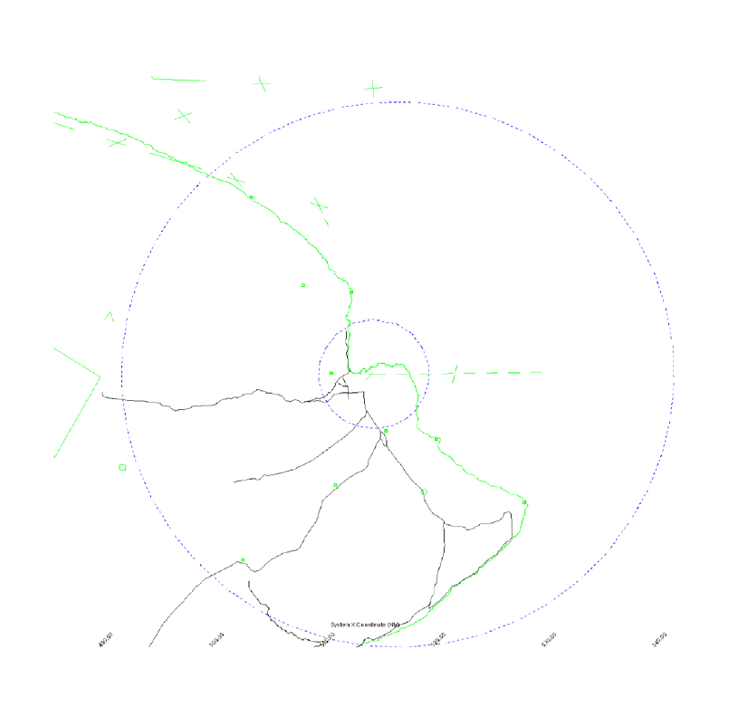

# 2. General Procedures

## 2.1 - Airspace

1. Provide air traffic control service within the depicted airspace up to and including 14,000 feet.

## 2.2 - Responsibilities

1. Issue appropriate clearances to IFR and VFR aircraft.

## 2.3 - Handoffs

1. ITO ATCT is NOT a radar tower. Radar handoffs shall not be used for aircraft entering or exiting ITO ATCTs area of responsibility.

## 2.4 - VFR Aircraft

1. Instruct departing VFR aircraft to maintain VFR at or below 1,500.
2. VFR aircraft not remaining within the pattern and leaving the Class D Airspace, will be assigned a unique beacon code.

## 2.5 - Departure Releases

1. Unless otherwise coordinated, ITO ATCT shall request departure releases from ITO TRACON for all IFR departures.
2. Departure Releases AND rolling calls will include the following content:
    1. Aircraft Callsign
    2. SID or Initial Waypoint
    3. Departure Runway
3. ITO TRACON may opt to provide ITO ATCT with blanket releases. If Blanket Releases are in effect, a Rolling Call will be sent to TRACON for each IFR departure.

## 2.6 - Missed Approached/Go Arounds

1. Advise aircraft on an **Instrument** approach, to fly the Published Missed Approach.
2. Advise aircraft on a **Visual** missed approach to fly the following:

| Runway | Heading and Altitude |
|:---:|:---:|
| 08 | Runway Heading and 4000 |
| 26 | Right 050 and 4000 |
| 03 | Runway Heading and 4000 |
| 21 | Left 360 and 4000 |
