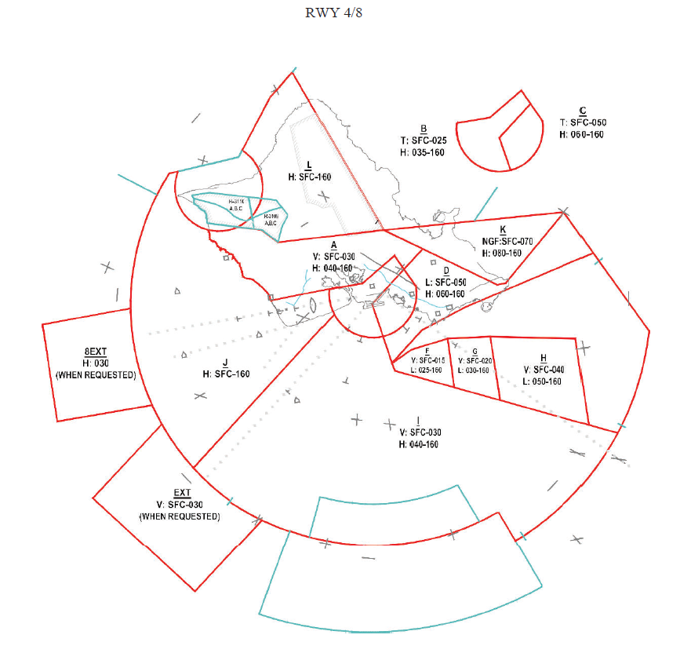
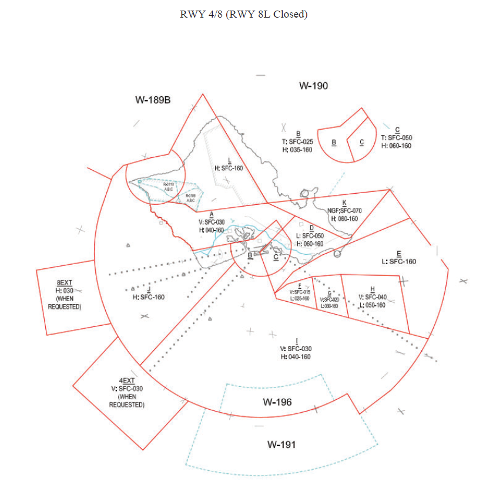
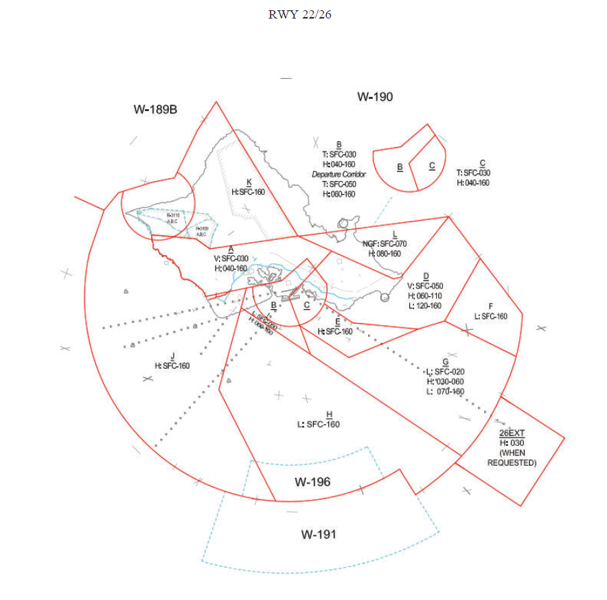
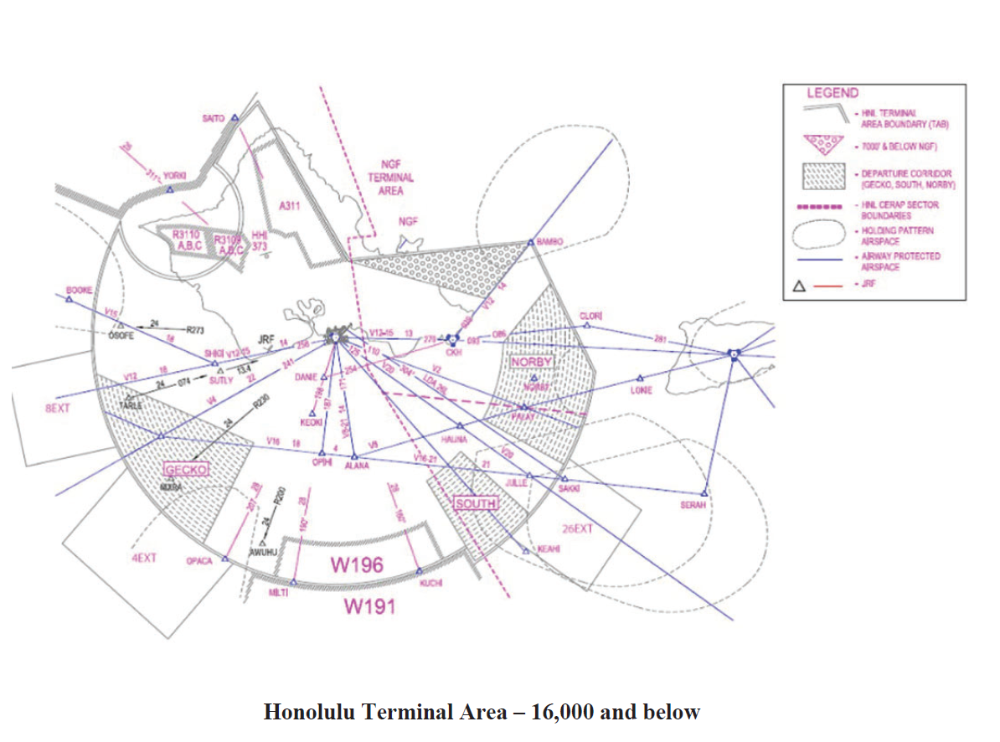
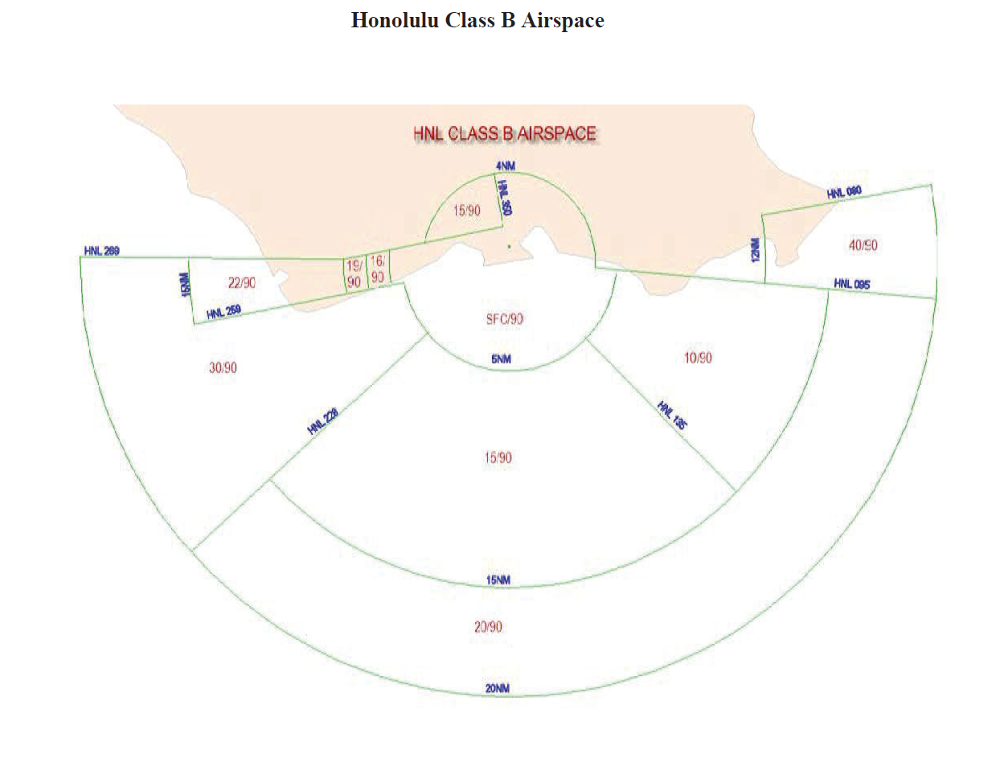

# 3. General Procedures

## 3.1 - Airspace

1. Provide air traffic control service up to and including 16,000 feet.
2. Narrowband Operations allow 3NM separation between aircraft.

## 3.2 - Sectorization

1. The primary “combined” radar position shall be Honolulu H Arrival (HH). No other sectors should be staffed until the “combined” position is already in use.
2. Once HH is in use, HH may delegate a portion of its airspace to Honolulu L Departure (HL) and V Arrival (HV).
3. When splitting, HL needs to be opened first and only after it HV.
4. During East Ops:
    1. HH will be the final sector all arrivals into HNL RW 8 and feed aircraft to HV.
    2. HV will be the final sector for all arrivals into HNL RW 4.
    3. HL will handle all departures from HNL.
5. During West Ops:
    1. HH will be the final sector all arrivals into HNL RW 22/26.
    2. HV will be the entry sector for all VFR arrivals into HNL from the north-west, north, north-east and east.
    3. HL will handle all departures from HNL.
6. No matter the Ops at HNL, each sector will be responsible for the satellite fields within their designated airspace.

## 3.3 - Departure Releases

1. Unless otherwise coordinated, ALL AIRPORTS within HNL TRACON shall request departure releases from HNL TRACON for all IFR departures.
2. Upon receipt of the departure release, the release shall remain valid for five (5) consecutive minutes.
3. Departure Releases AND rolling calls will include the following content:
    1. Aircraft Callsign
    2. SID or Initial Waypoint
    3. Departure Runway
4. HNL TRACON may opt to provide HNL ATCT with blanket releases. If blanket releases are in effect, a Rolling Call will be sent to HNL TRACON for each IFR departure.

## 3.4 - Missed Approach/Go-Arounds

1. **PHNL (Honolulu)**
    1. Advise aircraft on a visual missed approach in East ops to fly heading 150, climb and maintain 5,000ft and expect vectors to final approach course by contacting TRACON.
    2. Advise aircraft on a visual missed approach in West ops to fly heading 180, climb and maintain 4,000ft and expect vectors to final approach course by contacting TRACON.
    3. Advise aircraft on an instrument approach to fly the published missed approach and to contact TRACON.
    4. Alternatively, the following vectors can be given:
        1. RWY 4L/R: Authorized headings 130 CW 220.
        2. RWY 8L/R: After leaving 600 MSL, authorized headings 120 CW 250.
        3. RWY 22L: Authorized headings 110 CW 240
        4. RWY 22R: Authorized headings 115 CW 240.
        5. RWY 26L: Authorized headings 100 CW 250
        6. RWY 26R: Authorized headings 110 CW 250

2. **PHJR (Kalaeloa Airport - John Rogers Field)**
    1. Advise aircraft on a visual missed approach in East ops to fly heading 230, climb and maintain 3,000ft and expect vectors to final approach course by contacting TRACON.
    2. Advise aircraft on a visual missed approach in West ops to fly turn left heading of 040, climb and maintain 3,000ft and expect vectors to final approach course by contacting TRACON.
    3. Advise aircraft on an instrument approach to fly the published missed approach and to contact TRACON.

## 3.5 - Noise Abatement

1. All hours, the following will apply.
    1. Large/heavy aircraft arrivals from the east/northeast must not be descended below 8,000' over the island of Oahu.
    2. Large/heavy aircraft arrivals from the west/northwest must not be vectored north of the south shoreline of Oahu for a right base leg to RWY 22/26.
2. During the hours of 0630-2200 HST large aircraft may be sequenced to RWY 8L with a base leg at the Pearl Harbor Channel. Large aircraft on vectors for a visual approach to RWY 8L at the Pearl Harbor Channel must be instructed/vectored to enter the channel from the south.
3. During the hours of 2200-0700 HST all turbojet aircraft must be vectored to RWY 4R. When a request for RWY 8L is received, advise aircraft the runway is noise sensitive)
