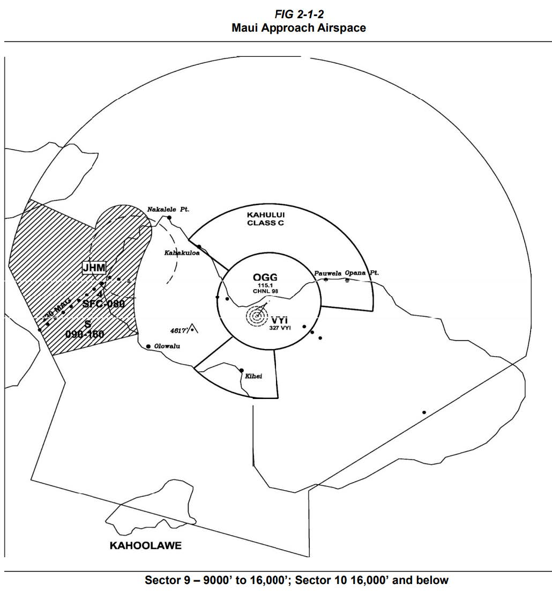

# 3. General Procedures

## 3.1 - Airspace

1. Provide air traffic control service up to and including 16,000 feet.

## 3.2 - Handoffs

1. OGG ATCT is NOT a radar tower. Radar handoffs shall not be used for aircraft entering OGG ATCTs area of responsibility. Any other ATCTs within OGG TRACON shall not receive a radar handoff for arriving aircraft.

## 3.3 - VFR Aircraft

1. Instruct departing VFR aircraft to maintain VFR at or below 1,500.
2. VFR aircraft not remaining within the pattern and requesting flight following will be given a de-parture frequency.
   1. VFR aircraft departing north shall receive ON as their departure frequency.
   2. VFR aircraft departing south shall receive OS as their departure frequency.
3. Assign all VFR aircraft leaving the Class C airspace a unique beacon code.

## 3.4 - Departure Releases

1. Unless otherwise coordinated, all airports within OGG TRACON shall request departure releases from OGG TRACON for all IFR departures.
2. Departure Releases AND rolling calls will include the following content:
   1. Aircraft Callsign
   2. SID or Initial Waypoint
   3. Departure Runway
3. OGG TRACON may opt to provide OGG ATCT with blanket releases. If Blanket Releases are in effect, a Rolling Call will be sent to TRACON for each IFR departure.

## 3.5 - Missed Approach/Go-Arounds

1. For aircraft on an **instrument** approach, OGG ACTC will instruct aircraft to fly the pub-lished missed approach and to contact TRACON.
2. For aircraft on a **visual** missed approach in North Flow, ATCT will instruct aircraft to fly heading 360, climb and maintain 4,000ft and contact TRACON.
3. For aircraft on a **visual** missed approach in South Flow, ATCT will instruct aircraft to fly heading 185, climb and maintain 5,000ft to contact TRACON.