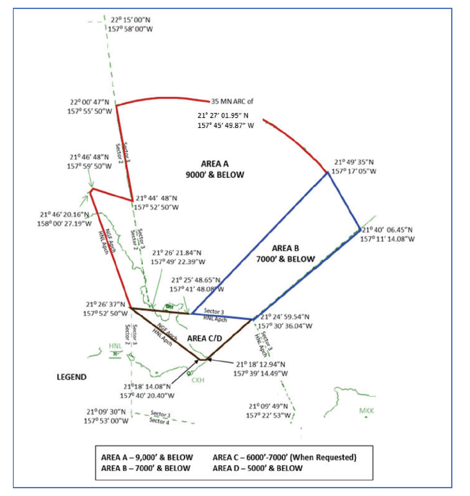

# 2. General Procedures

## 2.1 - Airspace

1. Area C can be delegated to NGF Approach on request.
2. HCF Center can delegate Area A up to FL240 upon request by NGF Approach.
3. NGF Tower maintains the airspace within 4.3 Nautical Miles radius of NGF, from surface up to 2,500’ AGL.

## 2.2 - Departure Procedures

1. Initial altitude is 9,000’ or requested altitude, whichever is lower.
2. Tower must request IFR release from HCF Sector 3 if NGF Approach is offline.
